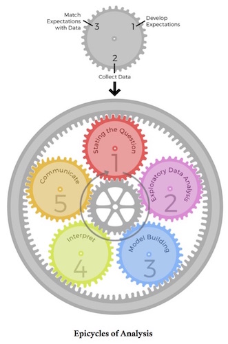
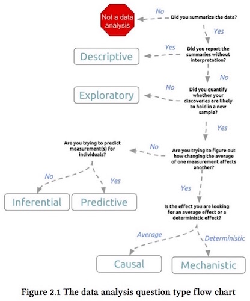

# Origins of Data Science

## Statistics and Machine Learning

<style type="text/css">
p { 
  text-align: left; 
  }
.reveal pre code { 
  color: #000000; 
  background-color: rgb(240,240,240);
  font-size: 1.15em;
  }
</style>

```{r cache=FALSE, echo=FALSE}
library(knitr)
opts_chunk$set(fig.align="center", fig.height=5.5, fig.width=6, collapse=TRUE, comment="", prompt=TRUE)
options(width=63)
```

**Statistics** is the study of the collection, analysis, interpretation, presentation, and organization of data.

<https://en.wikipedia.org/wiki/Statistics>

**Machine learning** explores the study and construction of algorithms that can learn from and make predictions on data. Machine learning is closely related to and often overlaps with computational statistics; a discipline which also focuses in prediction-making through the use of computers. 

<https://en.wikipedia.org/wiki/Machine_learning>

## Data Science

**Data Science** is an interdisciplinary field about processes and systems to extract knowledge or insights from data in various forms, either structured or unstructured, which is a continuation of some of the data analysis fields such as statistics, data mining, and predictive analytics.

<https://en.wikipedia.org/wiki/Data_science>

## What is Data Science?

- *Data Science* is a very new term

- No well-accepted definition

- Statistics, machine learning, and data science are all essentially about extracting knowledge or value from data

- DS deals with data in the following ways: collecting, storing, managing, wrangling, exploration, learning, discovery, communication, products

## Some History

## John Tukey

John Tukey pioneered a field called "exploratory data analysis" (EDA)

From [The Future of Data Analysis](https://projecteuclid.org/euclid.aoms/1177704711) (1962) *Annals of Mathematical Statistics* ...

> For a long time I have thought I was a statistician, interested in inferences from the particular to the general. But as I have watched mathematical statistics evolve, I have had cause to wonder and to doubt.

## John Tukey (cont'd)

> All in all, I have come to feel that my central interest is in data analysis, which I take to include, among other things: procedures for analyzing data, techniques for interpreting the results of such procedures, ways of planning the gathering of data to make its analysis easier, more precise or more accurate, and all the machinery and results of (mathematical) statistics which apply to analyzing data.

## John Tukey (cont'd)

> Data analysis is a larger and more varied field than inference, or incisive procedures, or allocation.

[IMO](http://simplystatistics.org/2015/08/25/interview-with-copss-award-winner-john-storey/), Tukey saw the need for and initiated data science in 1962

David Donoho [seems to agree](https://dl.dropboxusercontent.com/u/23421017/50YearsDataScience.pdf)

## Jeff Wu

> In November 1997, C.F. Jeff Wu gave the inaugural lecture entitled "Statistics = Data Science?". In this lecture, he characterized statistical work as a trilogy of data collection, data modeling and analysis, and decision making. In his conclusion, he initiated the modern, non-computer science, usage of the term "data science" and advocated that statistics be renamed data science and statisticians data scientists.

<https://en.wikipedia.org/wiki/Data_science>

## William Cleveland

 - In 2001, William Cleveland introduced data science as an independent discipline, extending the field of statistics to incorporate "advances in computing with data" in his article [Data Science: An Action Plan for Expanding the Technical Areas of the Field of Statistics](http://onlinelibrary.wiley.com/doi/10.1111/j.1751-5823.2001.tb00477.x/abstract) in  *International Statistical Review*

- Cleveland establishes six technical areas which he believed to encompass the field of data science: multidisciplinary investigations, models and methods for data, computing with data, pedagogy, tool evaluation, and theory.

(The above is modified text from [Wikipedia](https://en.wikipedia.org/wiki/Data_science).)

## Industry

- "In 2008, DJ Patil and Jeff Hammerbacher used the term 'data scientist' to define their jobs at LinkedIn and Facebook, respectively." ([from Wikipedia](https://en.wikipedia.org/wiki/Data_science))

- The term "data scientist" is now often used to describe positions in industry that primarily involve data, whether it is statistics, machine learning, data curation, or other data-centric activities

## Relevant Quotations

## Nate Silver

"I think data scientist is a sexed-up term for a statistician."

<http://simplystatistics.org/2013/08/08/data-scientist-is-just-a-sexed-up-word-for-statistician/>

## Twitter

- "Data science is statistics on a Mac."

- "A data scientist is a statistician who lives in San Francisco."

- "A data scientist is someone who is better at statistics than any software engineer and better at software engineering than any statistician."  

<http://datascopeanalytics.com/blog/what-is-a-data-scientist/>

## Hadley Wickham

"Recently, there has been much hand-wringing about the role of statistics in data science.

I think there are three main steps in a data science project: you collect data (and questions), analyze it (using visualization and models), then communicate the results."

<http://bulletin.imstat.org/2014/09/data-science-how-is-it-different-to-statistics%E2%80%89/>

## Hadley Wickham (cont'd)

"Statistics is a part of data science, not the whole thing. Statistics research focuses on data collection and modelling, and there is little work on developing good questions, thinking about the shape of data, communicating results or building data products."

<http://bulletin.imstat.org/2014/09/data-science-how-is-it-different-to-statistics%E2%80%89/>

## Jeff Leek

"The key word in Data Science is not Data, it is *Science*."

<http://simplystatistics.org/2013/12/12/the-key-word-in-data-science-is-not-data-it-is-science/>

<center></center>

<http://drewconway.com/zia/2013/3/26/the-data-science-venn-diagram>

<center></center>

# SML 201

## What we cover

- Using R to do data science
- Data wrangling
- Data exploration and visualization
- Inference, modeling, and prediction
- Data products (briefly)

## What we don't cover

- Python
- Databases
- Big data computing (e.g., Hadoop, MapReduce, Spark)
- Mathematical theory

## Other Princeton courses

- Fundamentals of statistics: ECO202, EEB355, POL345, WWS200, ORF245, PSY201, and SOC301

- Fundamentals of machine learning: SML302/COS424, ORF350

- SML 201 is complementary to these and can be taken before or after

## Course Logistics

<br>

<center>This course will be managed on:</center>

- [Blackboard](https://blackboard.princeton.edu/webapps/pu-courseredirect-bb_bb60/find.jsp?course_id=SML201_S2016)
- [Piazza](https://piazza.com/princeton/spring2016/sml201/home)
- <http://sml201.github.io>

<br>

<center>All course notes will be made available on GitHub:</center>

- <https://github.com/SML201>

# The Art of Data Science

## Data Analysis as Art

- Donald Knuth [said](https://en.wikiquote.org/wiki/Donald_Knuth), "Science is what we understand well enough to explain to a computer. Art is everything else we do."

- Data analysis involves a lot of science -- e.g., well-justified mathematical formulas that we can program a computer to calculate

- However, we cannot yet program a computer to carry out any data analysis from beginning to end

## Data Analysis as Art

- In *The Art of Data Science*, the authors point out that data analysis is largely an art

- There is a gap between what is typically taught in a statistics course and what is required to carry out an excellent data analysis

- The books *The Art of Data Science* and *The Elements of Data Analytic Style* attempt to begin to address this gap

## Examples

- Facebook's [Visualizing Friendships](https://www.facebook.com/note.php?note_id=469716398919)   (side note: [a discussion](http://flowingdata.com/2010/12/13/facebook-worldwide-friendships-mapped/))

- [Hans Rosling: Debunking third-world myths with the best stats you've ever seen](https://www.youtube.com/watch?v=RUwS1uAdUcI&t=3m22s&version=3)

- Flowing Data's [A Day in the Life of Americans](http://flowingdata.com/2015/12/15/a-day-in-the-life-of-americans/)

## Five Activities of Data Analysis

<br>

1. Stating and refining the question
2. Exploring the data
3. Building formal statistical models
4. Interpreting the results
5. Communicating the results

<br>

From *The Art of Data Science*.

<center></center>

From *The Art of Data Science*.

<center></center>

From *Elements of Data Analytic Style*.

## Common Mistakes

- Correlation does not imply causation
- Overfitting
- $n=1$ analysis (aka $n$ of 1 analysis)
- Data dredging


# Computing

## R

> - R is a programming language, a high-level "interpreted language"
> - R is an interactive environment
> - R is used for doing statistics and data science
> - R is free and open-source
> - R stays on the cutting-edge because of its ability to utilize independently developed "packages"
> - R has some [peculiar featues](http://www.johndcook.com/blog/r_language_for_programmers/) that experienced programmers should note (see [The R Inferno](http://www.burns-stat.com/pages/Tutor/R_inferno.pdf))
> - R has an [amazing](https://twitter.com/search?q=%23rstats) [community](http://stackoverflow.com/tags/r/info) of passionate users and developers

## RStudio

- RStudio is an IDE (integrated development environment) for R

- It contains many useful features for using R

- We will use the free version of RStudio in this course


# Getting Started in R

## Calculator

Operations on numbers: `+ - * / ^`

```{r}
2+1
```

```{r}
6+3*4-2^3
```

```{r}
6+(3*4)-(2^3)
```

## Atomic Classes

There are five atomic classes (or modes) of objects in R:

1. character
2. complex
3. integer
4. logical
5. numeric (real number)

There is a sixth called "raw" that we will not discuss.

## Assigning Values to Variables

```{r}
x <- "sml201" # character
x <- 2+1i     # complex
x <- 4L       # integer
x <- TRUE     # logical
x <- 3.14159  # numeric
```

Note: Anything typed after the `#` sign is not evaluated.  The `#` sign allows you to add comments to your code.

## More Ways to Assign Values

```{r}
x <- 1
1 -> x
x = 1
```

In this class, we ask that you only use `x <- 1`.

## Evaluation

When a complete expression is entered at the prompt, it is evaluated and the result of the evaluated expression is returned. The result may be auto-printed.

```{r}
x <- 1
x+2
print(x)
print(x+2)
```

## Functions

There are [many useful functions](http://www.statmethods.net/management/functions.html) included in R.  "Packages" (covered later) can be loaded as libraries to provide additional functions.  You can also write your own functions in any R session.

Here are some examples of built-in functions:

```{r}
x <- 2
print(x)
sqrt(x)
log(x)
class(x)
is.vector(x)
```

## Accessing Help in R

You can open the help file for any function by typing `?` with the functions name.  Here is an example:

```{r}
?sqrt
```

There's also a function `help.search` that can do general searches for help.  You can learn about it by typing:

```{r}
?help.search
```

It's also useful to use Google: for example, ["r help square root"](https://www.google.com/search?q=r+help+square+root).  The R help files are also on the web.

## Variable Names

In the previous examples, we used `x` as our variable name.  Do not use the following variable names, as they have special meanings in R:

```
c, q, s, t, C, D, F, I, T
```

When combining two words for a given variable, we recommend one of these options:

```{r}
my_variable <- 1
myVariable <- 1
```

Variable names such as `my.variable` are problematic because of the special use of "." in R.

## Vectors

The vector is the most basic object in R. You can create vectors in a number of ways.

```{r}
x <- c(1, 2, 3, 4, 5)
x

y <- 1:40
y

z <- seq(from=0, to=100, by=10)
z
length(z)
```

## Vectors

- Programmers: vectors are indexed starting at `1`, not `0`
- A vector can only contain elements of a single class:

```{r}
x <- "a"
x[0]
x[1]

y <- 1:3
z <- c(x, y, TRUE, FALSE)
z
```


## Matrices

Like vectors, matrices are objects that can contain elements of only one class.

```{r}
m <- matrix(1:6, nrow=2, ncol=3)
m

m <- matrix(1:6, nrow=2, ncol=3, byrow=TRUE)
m
```

## Factors

In statistics, factors encode categorical data. 

```{r}
paint <- factor(c("red", "white", "blue", "blue", "red", 
                  "red"))
paint

table(paint)
unclass(paint)
```

## Lists

Lists allow you to hold different classes of objects in one variable.

```{r}
x <- list(1:3, "a", c(TRUE, FALSE))
x

# access any element of the list
x[[2]]
x[[3]][2]
```

## Lists with Names

The elements of a list can be given names.

```{r}
x <- list(counting=1:3, char="a", logic=c(TRUE, FALSE))
x

# access any element of the list
x$char
x$logic[2]
```

# Extras

## License

<https://github.com/SML201/lectures/blob/master/LICENSE.md>


## Source Code

<https://github.com/SML201/lectures/tree/master/week1>

## Session Information

<section style="font-size: 0.75em;">
```{r}
sessionInfo()
```
</section>

