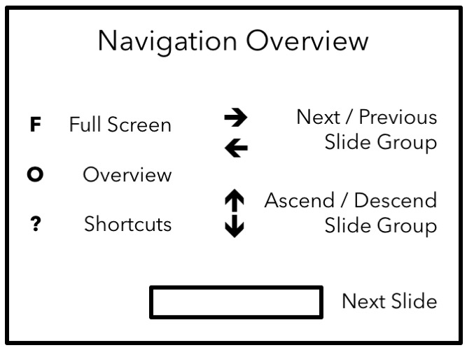

```{r my_opts, cache=FALSE, include=FALSE}
library(knitr)
knit_hooks$set(small.mar = function(before, options, envir) {
    if (before) par(mar = c(4, 4, .1, .1))  # smaller margin on top and right
})
opts_chunk$set(fig.align="center", fig.height=5.5, fig.width=6.75, collapse=TRUE, comment="", prompt=TRUE, small.mar=TRUE)
options(width=63)
library("ggplot2")
theme_set(theme_bw())
library("dplyr")
library("broom")
set.seed(201)
```

# </img>

# Statistics, ML, and Data Science

## Statistics

**Statistics** is the study of the collection, analysis, interpretation, presentation, and organization of data.

<https://en.wikipedia.org/wiki/Statistics>

## Machine Learning

**Machine learning** explores the study and construction of algorithms that can learn from and make predictions on data. Machine learning is closely related to and often overlaps with computational statistics; a discipline which also focuses in prediction-making through the use of computers. 

<https://en.wikipedia.org/wiki/Machine_learning>

## Data Science

**Data Science** is an interdisciplinary field about processes and systems to extract knowledge or insights from data in various forms, either structured or unstructured, which is a continuation of some of the data analysis fields such as statistics, data mining, and predictive analytics.

<https://en.wikipedia.org/wiki/Data_science>

# Learning

## A Definition

[Statistical learning](https://www.google.com/search?q=statistical+learning) (or statistical machine learning) is largely about using statistical modeling ideas to solve machine learning problems.  

"Learning" basically means using data to build or fit models.

## Quotations

From [*An Introduction to Statistical Learning*](http://www-bcf.usc.edu/~gareth/ISL/):

"Statistical learning refers to a vast set of tools for understanding data."

"Though the term statistical learning is fairly new, many of the concepts that underlie the field were developed long ago."

"Inspired by the advent of machine learning and other disciplines, statistical learning has emerged as a new subfield in statistics, focused on supervised and unsupervised modeling and prediction."

# A Modeling Framework

## Ordinary Least Squares

Suppose we observe data $(x_{11}, x_{21}, \ldots, x_{d1}, y_1), \ldots$, $(x_{1n}, x_{2n}, \ldots, x_{dn}, y_n)$.  We have a response variable $y_i$ and $d$ explanatory variables $(x_{1i}, x_{2i}, \ldots, x_{di})$ per unit of observation.

Ordinary least squares models the variation of $y$ in terms of $\beta_0 + \beta_1 x_1 + \beta_2 x_2 + \ldots + \beta_d x_d$.

## OLS Model

The assumed model is

$$Y_i = \beta_0 + \beta_1 X_{1i} + \beta_2 X_{2i} + \ldots + \beta_d X_{di} + E_i$$

where ${\rm E}[E_i] = 0$, ${\rm Var}(E_i) = \sigma^2$, and $\rho_{E_i, E_j} = 0$ for all $1 \leq i, j \leq n$ and $i \not= j$.

## A More General Model

Let's collapse $X_i = (X_{1i}, X_{2i}, \ldots, X_{di})$.  A more general model is

$$Y_i = f(X_i) + E_i,$$

with the same assumptions on $E_i$, for some function $f$ that maps the $d$ variables into the real numbers.

## Modeling Fitting

<center></center>

<font size=1em>
Figure credit: [*ISL*](http://www-bcf.usc.edu/~gareth/ISL/)
</font>

## Example True Model

<center></center>

<font size=1em>
Figure credit: [*ISL*](http://www-bcf.usc.edu/~gareth/ISL/)
</font>

## OLS Linear Model

<center></center>

<font size=1em>
Figure credit: [*ISL*](http://www-bcf.usc.edu/~gareth/ISL/)
</font>

## A Flexible Model

<center></center>

<font size=1em>
Figure credit: [*ISL*](http://www-bcf.usc.edu/~gareth/ISL/)
</font>

## Variable Names

Input variables $(X_{1}, X_{2}, \ldots, X_{d})$:

- explanatory variables
- covariates
- predictors
- independent variables
- feature variables 

Output variable $(Y)$:

- response variable
- dependent variable
- label
- outcome variable

## Learning Types

**Supervised learning** is aimed at fitting models to $(X,Y)$ so that we can model the output $Y$ given the input $X$, typically on future observations.  **Prediction models**  are built by supervised learning.

**Unsupervised learning** (next week's topic) is aimed at fitting models to $X$ alone to charcaterize the distribution of or find patterns in $X$.

## Prediction

We often want to fit $Y = f(X) + E$ for either **prediction** or **inference**.

When observed $x$ are readily available but $y$ is not, the goal is usually *prediction*.  If $\hat{f}(x)$ is the estimated model, we predict $\hat{y} = \hat{f}(x)$ for an observed $x$.  Here, $\hat{f}$ is often treated as a black box and we mostly care that it provides accurate predictions.

## Inference

When we co-observe $x$ and $y$, we are often interested in understanding the way that $y$ is explained by varying $x$ or is a causal effect of $x$ -- and we want to be able to explicitly quantify these relationships.  This is the goal of *inference*.  Here, we want to be able to estimate and interpret $f$ as accurately as possible -- and have it be as close as possible to the underlying real-world mechanism connecting $x$ to $y$.

## Regression vs Classification

When $Y \in (-\infty, \infty)$, learning $Y = f(X) + E$ is called **regression**.

When $Y \in \{0,1\}$ or more generally $Y \in \{c_1, c_2, \ldots, c_K\}$, we want to learn a function $f(X)$ that takes values in $\{c_1, c_2, \ldots, c_K\}$ so that ${\rm Pr}\left(Y=f(X)\right)$ is as large as possible.  This is called **classification**.

## Parametric vs Nonparametric

A **parametric** model is a pre-specified form of $f(X)$ whose terms can be characterized by a formula and interpreted. This usually involves parameters on which inference can be performed, such as coefficients in the OLS model.

A **nonparametric** model is a data-driven form of $f(X)$ that is often very flexible and is not easily expressed or intepreted.  A nonparametric model often does not include parameters on which we can do inference.

# Accuracy of Learners

## Decomposing Error

Let $\hat{Y} = \hat{f}(X)$ be the output of the learned model.  Suppose that $\hat{f}$ and $X$ are fixed.  We can then define the error of this fitted model by:

\begin{eqnarray}
{\rm E}\left[\left(Y - \hat{Y}\right)^2\right] & = & {\rm E}\left[\left(f(X) + E - \hat{f}(X)\right)^2\right] \\
\ & = & {\rm E}\left[\left(f(X) - \hat{f}(X)\right)^2\right] + {\rm Var}(E)
\end{eqnarray}

The term ${\rm E}\left[\left(f(X) - \hat{f}(X)\right)^2\right]$ is the **reducible error** and the term ${\rm Var}(E)$ is the **irreducible error**.

## Error Rates

On an observed data set $(x_1, y_1), \ldots, (x_n, y_n)$ we usually calculate error rates as follows.

For regression, we calculate the mean-squared error:

$$\mbox{MSE} = \frac{1}{n} \sum_{i=1}^n \left(y_i - \hat{f}(x_i)\right)^2.$$

For classificaiton, we calculate the misclassification rate:

$$\mbox{MCR} = \frac{1}{n} \sum_{i=1}^n 1[y_i = \hat{f}(x_i)],$$

where $1[\cdot]$ is 0 or 1 whether the argument is false or true, respectively.

## Training vs Testing

We typically fit the model on one data set and then assess its accuracy on an independent data set.  

The data set used to fit the model is called the **training data set**.

The data set used to test the model is called the **testing data set** or **test data set**.

## Important Questions

1.  Why do we need training and testing data sets to accurately assess a learned model's accuracy?

2.  How is this approach notably different from the inference approach we learned earlier?

## Overfitting

**Overfitting** is a very important concept in statistical machine learning.

It occurs when the fitted model follows the noise term too closely.

In other words, when $\hat{f}(X)$ is overfitting the $E$ term in  $Y = f(X) + E$.

## Performance of Different Models

<center></center>

<font size=1em>
Figure credit: [*ISL*](http://www-bcf.usc.edu/~gareth/ISL/)
</font>

----

<center></center>

<font size=1em>
Figure credit: [*ISL*](http://www-bcf.usc.edu/~gareth/ISL/)
</font>

----

<center></center>

<font size=1em>
Figure credit: [*ISL*](http://www-bcf.usc.edu/~gareth/ISL/)
</font>

----

<center></center>

<font size=1em>
Figure credit: [*ISL*](http://www-bcf.usc.edu/~gareth/ISL/)
</font>


# Trade-offs

## Two Trade-offs

There are several important trade-offs encountered in prediction or learning:

- Bias vs variance
- Accuracy vs computational time
- Flexibility vs intepretability

These are not mutually exclusive phenomena.

## Bias and Variance

\begin{eqnarray}
{\rm E}\left[\left(Y - \hat{Y}\right)^2\right] & = & {\rm E}\left[\left(f(X) + E - \hat{f}(X)\right)^2\right] \\
\ & = & {\rm E}\left[\left(f(X) - \hat{f}(X)\right)^2\right] + {\rm Var}(E) \\
\ & = & \left(f(X) - {\rm E}[\hat{f}(X)]\right)^2 + {\rm Var}\left(\hat{f}(X)\right)^2 + {\rm Var}(E) \\ 
\ & = & \mbox{bias}^2 + \mbox{variance} + {\rm Var}(E)
\end{eqnarray}

## Flexibility vs Interpretability

<center></center>

<font size=1em>
Figure credit: [*ISL*](http://www-bcf.usc.edu/~gareth/ISL/)
</font>

# Logistic Regression

# Spam Example

# Cross-Validation

# A Prediction Framework in R

# Extras

## License

<https://github.com/SML201/lectures/blob/master/LICENSE.md>

## Source Code

<https://github.com/SML201/lectures/tree/master/week11>

## Session Information

<section style="font-size: 0.75em;">
```{r}
sessionInfo()
```
</section>

```{r converttonotes, include=FALSE, cache=FALSE}
source("../customization/make_notes.R")
```
