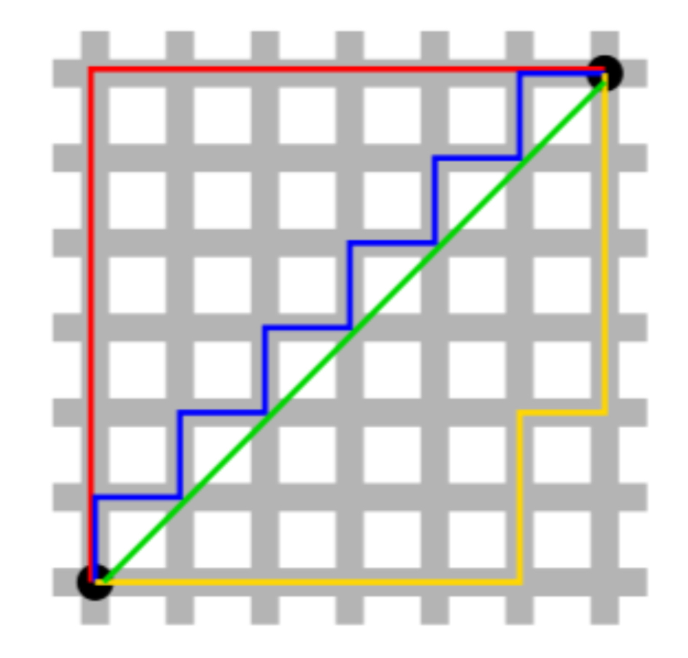
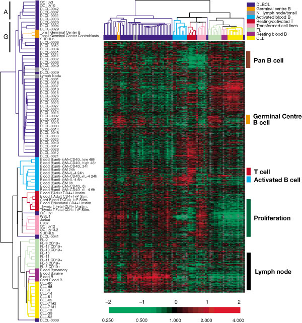

```{r my_opts, cache=FALSE, include=FALSE}
library(knitr)
knit_hooks$set(small.mar = function(before, options, envir) {
    if (before) par(mar = c(4, 4, .1, .1))  # smaller margin on top and right
})
opts_chunk$set(fig.align="center", fig.height=5.5, fig.width=6.75, collapse=TRUE, comment="", prompt=TRUE, small.mar=TRUE)
options(width=63)
library("ggplot2")
theme_set(theme_bw())
library("dplyr")
library("broom")
set.seed(201)
```

# </img>

# High-Dimensional Data

## Definition

**High-dimensional data** (HD data) typically refers to data sets where *many variables* are simultaneously measured on any number of observations.

The number of variables is often represented by $p$ and the number of observations by $n$.  

HD data are collected into a $p \times n$ or $n \times p$ matrix.  

Many methods exist for "large $p$, small $n$" data sets.

## Examples

- Clinical studies
- Genomics (e.g., gene expression)
- Neuroimaging (e.g., fMRI)
- Finance (e.g., time series)
- Environmental studies
- Internet data (e.g., Netflix movie ratings)

## Big Data vs HD Data

"Big data" are data sets that cannot fit into a standard computer's memory.

HD data were defined above.

They are not necessarily equivalent.

# Cluster Analysis

## Definition

**Cluster analysis** is the process of grouping objects (variables or observations) into groups based on measures of similarity.  

Similar objects are placed in the same cluster, and dissimilar objects are placed in different clusters.

Cluster analysis methods are typically described by algorithms (rather than models or formulas).

## Types of Clustering

Clustering can be categorized in various ways:

- Hard vs. soft
- Top-down vs bottom-up
- Partitioning vs. hierarchical agglomerative

## Top-Down vs Bottom-Up

We will discuss two of the major clustering methods -- *hierarchical clustering* and *K-means clustering*.

Hierarchical clustering is an example of *bottom-up* clustering in that the process begings with each object being its own cluster and then objects are joined in a hierarchical manner into larger and larger clusters.

$K$-means clustering is an example of *top-down* clustering in that the number of clusters is chosen beforehand and then object are assigned to one of the $K$ clusters.

## Challenges

- Cluster analysis method
- Distance measure
- Number of clusters
- Convergence issues

# Illustrative Data Sets

## Simulated `data1`

```{r, echo=FALSE}
set.seed(201)
x <- c(rnorm(50, mean=2, sd=0.3), rnorm(50, mean=2, sd=0.3), rnorm(50, mean=4, sd=0.3))
y <- c(rnorm(50, mean=2, sd=0.3), rnorm(50, mean=4, sd=0.3), rnorm(50, mean=3, sd=0.3))
data1 <- data.frame(x=x, y=y, true_clusters=factor(c(rep(1,50), rep(2, 50), rep(3, 50))))
ggplot(data1) + geom_point(aes(x=x,y=y), size=2)
```

## "True" Clusters `data1`

```{r, echo=FALSE}
ggplot(data1) + geom_point(aes(x=x,y=y, col=true_clusters), size=2) +
  scale_color_manual(values=c("red", "blue", "gray47"))
```

## Simulated `data2`

```{r, echo=FALSE}
set.seed(201)
x <- c(rnorm(60, mean=2, sd=0.3), rnorm(80, mean=4, sd=0.3))
y <- c(rnorm(60, mean=2, sd=0.3), rnorm(80, mean=runif(80, min=1, max=3), sd=0.3))
data2 <- data.frame(x=x, y=y, true_clusters=factor(c(rep(1,60), rep(2, 80))))
ggplot(data2) + geom_point(aes(x=x,y=y), size=2)
```

## "True" Clusters `data2`

```{r, echo=FALSE}
ggplot(data2) + geom_point(aes(x=x,y=y, col=true_clusters), size=2) +
  scale_color_manual(values=c("red", "blue"))
```

# Distance Measures

## Objects

Most clustering methods require calculating a "distance" between two objects.

Let $\pmb{a} = (a_1, a_2, \ldots, a_n)$ be one object and $\pmb{b} = (b_1, b_2, \ldots, b_n)$ be another object.

We will assume both objects are composed of real numbers.

## Euclidean

Euclidean distance is the shortest spatial distance between two objects in Euclidean space.

Euclidean distance is calculated as:

$$d(\pmb{a}, \pmb{b}) = \sqrt{\sum_{i=1}^n \left(a_i - b_i \right)^2}$$

## Manhattan

Manhattan distance is sometimes called taxicab distance.  If you picture two locations in a city, it is the distance a taxicab must travel to get from one location to the other.

Manhattan distance is calculated as:

$$d(\pmb{a}, \pmb{b}) = \sum_{i=1}^n \left| a_i - b_i \right|$$

## Euclidean vs Manhattan

<center></center>

<font size=3em>
Green is Euclidean.  All others are Manhattan (and equal). Figure from [*Exploratory Data Analysis with R*](https://leanpub.com/exdata).
</font>

## `dist()`

A distance matrix -- which is the set of values resulting from a distance measure applied to all pairs of objects -- can be obtained through the function `dist()`.

Default arguments for `dist()`:
```{r}
str(dist)
```

The key argument for us is `method=` which can take values `method="euclidean"` and `method="manhattan"` among others.  See `?dist`.

## Distance Matrix `data1`

```{r}
sub_data1 <- data1[1:4, c(1,2)]
sub_data1
mydist <- dist(sub_data1)
print(mydist)
```

```{r}
(sub_data1[1,] - sub_data1[2,])^2 %>% sum() %>% sqrt()
```

# Hierarchical Clustering

## Strategy

Hierarchical clustering is a hierarchical agglomerative, bottom-up clustering method that strategically joins objects into larger and larger clusters, until all objects are contained in a single cluster.

Hierarchical clustering results are typically displayed as a [dendrogram](https://en.wikipedia.org/wiki/Dendrogram).

The number of clusters does not necessarily need to be known or chosen by the analyst.

## Example: Cancer Subtypes

<center></center>

<font size=3em>
Figure from [Alizadeh et al. (2000) *Nature*](http://www.nature.com/nature/journal/v403/n6769/abs/403503a0.html).
</font>

## Algorithm

The algorithm for hierarchical clustering works as follows.

1. Start with each object assigned as its own cluster.
2. Calculate a distance between all pairs of clusters.
3. Join the two clusters with the smallest distance.
4. Repeat steps 2--3 until there is only one cluster.

At the very first iteration of the algorithm, all we need is some distance function (e.g., Euclidean or Manhattan) to determine the two objects that are closest.  But once clusters with more than one object are present, how do we calculate the distance between two clusters?  This is where a key choice called the *linkage method or criterion* is needed.

## Linkage Criteria

Suppose there are two clusters $A$ and $B$ and we have a distance function $d(\pmb{a}, \pmb{b})$ for all objects $\pmb{a} \in A$ and $\pmb{b} \in B$.  Here are three ways (among many) to calculate a distance between clusters $A$ and $B$:

\begin{eqnarray}
\mbox{Complete: } & \max \{d(\pmb{a}, \pmb{b}): \pmb{a} \in A, \pmb{b} \in B\} \\
\mbox{Single: } & \min \{d(\pmb{a}, \pmb{b}): \pmb{a} \in A, \pmb{b} \in B\} \\
\mbox{Average: } & \frac{1}{|A| |B|} \sum_{\pmb{a} \in A} \sum_{\pmb{b} \in B} d(\pmb{a}, \pmb{b})
\end{eqnarray}

## `hclust()`

The `hclust()` function produces an R object that contains all of the information needed to create a complete hierarchical clustering.

Default arguments for `hclust()`:
```{r}
str(hclust)
```

The primary input for `hclust()` is the `d` argument, which is a distance matrix (usually obtained from `dist()`).  The `method` argument takes the linkage method, which includes `method="complete"`, `method="single"`, `method="average"`, etc.  See `?hclust`.

## Hierarchical Clustering of `data1`

```{r, echo=FALSE}
ggplot(data1) + geom_point(aes(x=x,y=y), size=2)
```

## Standard `hclust()` Usage

```{r}
mydist <- dist(data1, method = "euclidean")
myhclust <- hclust(mydist, method="complete")
plot(myhclust)
```

## `as.dendrogram()`

```{r}
plot(as.dendrogram(myhclust))
```

## Modify the Labels

```{r, message=FALSE, warning=FALSE}
library(dendextend)
dend1 <- as.dendrogram(myhclust)
labels(dend1) <- data1$true_clusters
labels_colors(dend1) <- 
  c("red", "blue", "gray47")[as.numeric(data1$true_clusters)]
plot(dend1, axes=FALSE, main=" ", xlab=" ")
```

## Color the Branches

```{r}
dend2 <- as.dendrogram(myhclust)
labels(dend2) <- rep(" ", nrow(data1))
dend2 <- color_branches(dend2, k = 3, col=c("red", "blue", "gray47"))
plot(dend2, axes=FALSE, main=" ", xlab=" ")
```

## Cluster Assignments ($K = 3$)

```{r}
est_clusters <- cutree(myhclust, k=3)
est_clusters
```

```{r, eval=FALSE}
est_clusters <- factor(est_clusters)
p <- data1 %>% 
  mutate(est_clusters=est_clusters) %>% 
  ggplot()
p + geom_point(aes(x=x, y=y, color=est_clusters))
```

## Cluster Assignments ($K = 3$)

```{r, echo=FALSE}
rm(est_clusters)
p <- data1 %>% 
  mutate(est_clusters=factor(cutree(myhclust, k=3))) %>% 
  ggplot()
p + geom_point(aes(x=x, y=y, color=est_clusters))
```


## Cluster Assignments ($K = 2$)

```{r}
(data1 %>% 
   mutate(est_clusters=factor(cutree(myhclust, k=2))) %>% 
   ggplot()) + geom_point(aes(x=x, y=y, color=est_clusters))
```

## Cluster Assignments ($K = 4$)

```{r}
(data1 %>% 
   mutate(est_clusters=factor(cutree(myhclust, k=4))) %>% 
   ggplot()) + geom_point(aes(x=x, y=y, color=est_clusters))
```

## Cluster Assignments ($K = 6$)

```{r}
(data1 %>% 
   mutate(est_clusters=factor(cutree(myhclust, k=6))) %>% 
   ggplot()) + geom_point(aes(x=x, y=y, color=est_clusters))
```

## Linkage: Complete (Default)

```{r}
data1 %>% dist() %>% hclust(method="complete") %>% 
  as.dendrogram() %>% plot(axes=FALSE)
```

## Linkage: Average

```{r}
data1 %>% dist() %>% hclust(method="average") %>% 
  as.dendrogram() %>% plot(axes=FALSE)
```

## Linkage: Single

```{r}
data1 %>% dist() %>% hclust(method="single") %>% 
  as.dendrogram() %>% plot(axes=FALSE)
```

## Linkage: Ward

```{r}
data1 %>% dist() %>% hclust(method="ward.D") %>% 
  as.dendrogram() %>% plot(axes=FALSE)
```

## Hierarchical Clustering of `data2`

```{r, echo=FALSE}
ggplot(data2) + geom_point(aes(x=x,y=y), size=2)
```

## `as.dendrogram()`

```{r}
mydist <- dist(data2, method = "euclidean")
myhclust <- hclust(mydist, method="complete")
plot(as.dendrogram(myhclust))
```

## Modify the Labels

```{r, message=FALSE, warning=FALSE}
library(dendextend)
dend1 <- as.dendrogram(myhclust)
labels(dend1) <- data2$true_clusters
labels_colors(dend1) <- 
  c("red", "blue")[as.numeric(data2$true_clusters)]
plot(dend1, axes=FALSE, main=" ", xlab=" ")
```

## Color the Branches

```{r}
dend2 <- as.dendrogram(myhclust)
labels(dend2) <- rep(" ", nrow(data2))
dend2 <- color_branches(dend2, k = 2, col=c("red", "blue"))
plot(dend2, axes=FALSE, main=" ", xlab=" ")
```

## Cluster Assignments ($K = 2$)

```{r}
(data2 %>% 
   mutate(est_clusters=factor(cutree(myhclust, k=2))) %>% 
   ggplot()) + geom_point(aes(x=x, y=y, color=est_clusters))
```

## Cluster Assignments ($K = 3$)

```{r}
(data2 %>% 
   mutate(est_clusters=factor(cutree(myhclust, k=3))) %>% 
   ggplot()) + geom_point(aes(x=x, y=y, color=est_clusters))
```

## Cluster Assignments ($K = 4$)

```{r}
(data2 %>% 
   mutate(est_clusters=factor(cutree(myhclust, k=4))) %>% 
   ggplot()) + geom_point(aes(x=x, y=y, color=est_clusters))
```

## Cluster Assignments ($K = 5$)

```{r}
(data2 %>% 
   mutate(est_clusters=factor(cutree(myhclust, k=6))) %>% 
   ggplot()) + geom_point(aes(x=x, y=y, color=est_clusters))
```


# K-Means Clustering

## Strategy

K-means clustering is a top-down, partitioning cluster analysis method that assigns each object to one of $K$ clusters based on the distance between each object and the cluster centers, called *centroids*.

This is an iterative algorithm with potential random initial values.

The value of $K$ is typically unknown and must be determined by the analyst.

## Centroid

A centroid is the coordinate-wise average of all objects in a cluster.

Let $A$ be a given cluster with objects $\pmb{a} \in A$. Its centroid is:

$$\overline{\pmb{a}} = \frac{1}{|A|} \sum_{\pmb{a} \in A} \pmb{a}$$ 

## Algorithm

The number of clusters $K$ must be chosen beforehand.

1. Initialize $K$ cluster centroids.
2. Assign each object to a cluster by choosing the cluster with the smalllest distance (e.g., Euclidean) between the object and the cluster centroid.
3. Calculate new centroids based on the cluster assignments from Step 2.
4. Repeat Steps 2--3 until convergence.

## Notes

The initialization of the centroids is typically random, so often the algorithm is run several times with new, random initial centroids.

Convergence is usually defined in terms of neglible changes in the centroids or no changes in the cluster assignments.  

## `kmeans()`

K-means clustering can be accomplished through the following function:
```{r}
str(kmeans)
```

- `x`: the data to clusters, objects along rows
- `centers`: either the number of clusters $K$ or a matrix giving initial centroids
- `iter.max`: the maximum number of iterations allowed
- `nstart`: how many random intial $K$ centroids, where the best one is returned

## `fitted()`

The cluster centroids or assigments can be extracted through the function `fitted()`, which is applied to the output of `kmeans()`.  

The input of `fitted()` is the object returned by `kmeans()`.  The key additional argument is called `method`.

When `method="centers"` it returns the centroids.  When `method="classes"` it returns the cluster assignments.

## K-Means Clustering of `data1`

```{r}
km1 <- kmeans(x=data1[,-3], centers=3, iter.max=100, nstart=5)
est_clusters <- fitted(km1, method="classes")
est_clusters
```

## Centroids of `data1`

```{r}
centroids1 <- fitted(km1, method="centers") %>% unique()
centroids1
```
```{r}
est_clusters <- fitted(km1, method="classes")
data1 %>% mutate(est_clusters = factor(est_clusters)) %>% 
  group_by(est_clusters) %>% summarize(mean(x), mean(y))
```

## Cluster Assignments ($K = 3$)

```{r}
est_clusters <- factor(est_clusters)
ggplot(data1) + geom_point(aes(x=x, y=y, color=est_clusters))
```

## Cluster Assignments ($K = 2$)

```{r, echo=FALSE}
rm(est_clusters)
est_clusters <- data1 %>% 
  kmeans(centers=2, iter.max=100, nstart=5) %>%
  fitted(method="classes") %>%
  factor()
ggplot(data1) + geom_point(aes(x=x, y=y, color=est_clusters))
```

## Cluster Assignments ($K = 6$)

```{r, echo=FALSE}
rm(est_clusters)
est_clusters <- data1 %>% 
  kmeans(centers=6, iter.max=100, nstart=5) %>%
  fitted(method="classes") %>%
  factor()
ggplot(data1) + geom_point(aes(x=x, y=y, color=est_clusters))
```

## K-Means Clustering of `data2`

```{r}
km2 <- kmeans(x=data2[,-3], centers=2, iter.max=100, nstart=5)
est_clusters <- fitted(km2, method="classes")
est_clusters
```

## Cluster Assignments ($K = 2$)

```{r}
est_clusters <- factor(est_clusters)
ggplot(data2) + geom_point(aes(x=x, y=y, color=est_clusters))
```

## Cluster Assignments ($K = 3$)

```{r, echo=FALSE}
rm(est_clusters)
est_clusters <- data2 %>% 
  kmeans(centers=3, iter.max=100, nstart=5) %>%
  fitted(method="classes") %>%
  factor()
ggplot(data2) + geom_point(aes(x=x, y=y, color=est_clusters))
```

## Cluster Assignments ($K = 5$)

```{r, echo=FALSE}
rm(est_clusters)
est_clusters <- data2 %>% 
  kmeans(centers=5, iter.max=100, nstart=5) %>%
  fitted(method="classes") %>%
  factor()
ggplot(data2) + geom_point(aes(x=x, y=y, color=est_clusters))
```

# Dimension Reduction

# Principal Components Analysis

# Summary of SML 201

# Extras

## License

<https://github.com/SML201/lectures/blob/master/LICENSE.md>

## Source Code

<https://github.com/SML201/lectures/tree/master/week12>

## Session Information

<section style="font-size: 0.75em;">
```{r}
sessionInfo()
```
</section>

```{r converttonotes, include=FALSE, cache=FALSE}
source("../customization/make_notes.R")
```
