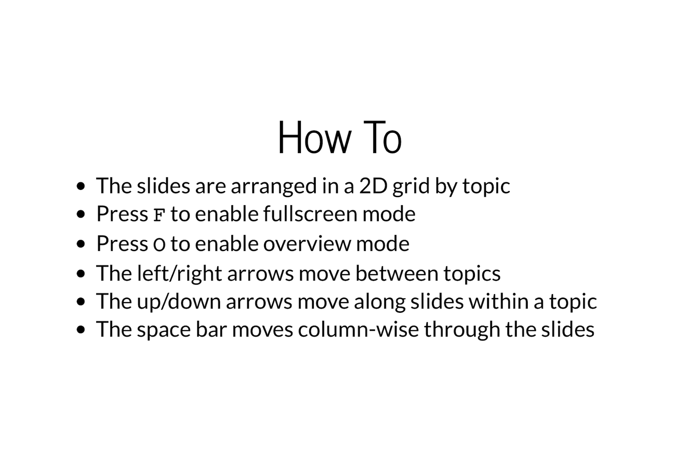

```{r my_opts, cache=FALSE, include=FALSE}
library(knitr)
knit_hooks$set(small.mar = function(before, options, envir) {
    if (before) par(mar = c(4, 4, .1, .1))  # smaller margin on top and right
})
opts_chunk$set(fig.align="center", fig.height=5.5, fig.width=6.75, collapse=TRUE, comment="", prompt=TRUE, small.mar=TRUE)
options(width=63)
library("rvest")
library("dplyr")
library("datasets")
```

# </img>

# R Packages

## Install These Packages

Run this code in RStudio and let us know if you experience any errors.

```{r, eval=FALSE, prompt=FALSE}
pkgs <- c("dplyr", "babynames", "readr", "tidyr", "reshape2", 
          "hexbin", "ggplot2", "ggthemes", "broom", 
          "devtools", "RColorBrewer", "rvest", "xtable")
install.packages(pkgs)
```


# Manipulating Data Frames

## `dplyr` Package

`dplyr` is a package with the following description:

> A fast, consistent tool for working with data frame like objects, both in memory and out of memory.

This package offers a "grammar" for manipulating data frames.  

Everything that `dplyr` does can also be done using basic R commands -- however, it tends to be much faster and easier to use `dplyr`.

## Grammar of `dplyr`

Verbs:

- `filter`: extract a subset of rows from a data frame based on logical conditions
- `arrange`: reorder rows of a data frame
- `rename`: rename variables in a data frame
- `select`: return a subset of the columns of a data frame, using a flexible notation

Partially based on *R Programming for Data Science* 


## Grammar of `dplyr`

Verbs (continued):

- `mutate`: add new variables/columns or transform existing variables
- `distinct`: returns only the unique values in a table
- `summarize`: generate summary statistics of different variables in the data frame, possibly within strata
- `group_by`: breaks down a dataset into specified groups of rows

Partially based on *R Programming for Data Science* 

## Example: Baby Names

```{r, include=FALSE}
rm(list=ls())
```

```{r}
library("dplyr", verbose=FALSE)
library("babynames")
ls()
babynames <- babynames::babynames
ls()
```

## `babynames` Object

```{r}
class(babynames)
dim(babynames)
```

```{r}
babynames
```

## Peek at the Data

```{r}
set.seed(201)
sample_n(babynames, 10) 
# try also sample_frac(babynames, 6e-6)
```

## `%>%` Operator

Originally from R package `magrittr`.  Provides a mechanism for chaining commands with a forward-pipe operator, `%>%`.

```{r}
x <- 1:10

x %>% log(base=10) %>% sum

sum(log(x,base=10))
```

```{r}
babynames %>% sample_n(5)
```

## `filter()`

```{r}
filter(babynames, year==1880, sex=="F")
# same as filter(babynames, year==1880 & sex=="F")
```

```{r}
filter(babynames, year==1880, sex=="F", n > 5000)
```

## `arrange()`

```{r}
arrange(babynames, name, year, sex)
```

## `arrange()`

```{r}
arrange(babynames, desc(name), desc(year), sex)
```

## `rename()`

```{r}
rename(babynames, number=n)
```

## `select()`

```{r}
select(babynames, sex, name, n)
# same as select(babynames, sex:n)
```

## Renaming with `select()`
```{r}
select(babynames, sex, name, number=n)
```

## `mutate()`

```{r}
mutate(babynames, total_by_year=round(n/prop))
# see also transmutate
```

## No. Individuals by Year and Sex

Let's put a few things together now adding the function `distinct()`...

```{r}
babynames %>% mutate(total_by_year=round(n/prop)) %>% 
  select(sex, year, total_by_year) %>% distinct()
```

## `summarize()`

```{r}
summarize(babynames, mean_n = mean(n), median_n = median(n), 
          number_sex = n_distinct(sex), 
          distinct_names = n_distinct(name))
```

## `group_by()`

```{r}
babynames %>% group_by(year, sex)
```

## No. Individuals by Year and Sex

```{r}
babynames %>% group_by(year, sex) %>% 
  summarize(total_by_year=sum(n))
```

Compare to earlier slide. Why the difference?

## How Many Distinct Names?

```{r}
babynames %>% group_by(sex) %>% 
  summarize(mean_n = mean(n), 
            distinct_names_sex = n_distinct(name))
```


## Most Popular Names

```{r}
top_names <- babynames %>% group_by(year, sex) %>% 
  summarize(top_name = name[which.max(n)])

head(top_names)
```


## Most Popular Names
### Recent Years

```{r}
tail(top_names, n=10)
```

## Most Popular Female Names 
### 1990s

```{r}
top_names %>% filter(year >= 1990 & year < 2000, sex=="F")
```

## Most Popular Male Names 
### 1990s

```{r}
top_names %>% filter(year >= 1990 & year < 2000, sex=="M")
```

----
```{r, small.mar=TRUE}
# Analyzing the name 'John'
john <- babynames %>% filter(sex=="M", name=="John")
plot(john$year, john$prop, type="l")
```


----
```{r, small.mar=TRUE}
# Analyzing the name 'Bella'
bella <- babynames %>% filter(sex=="F", name=="Bella") 
plot(bella$year, bella$prop, type="l")
```

## Additional Examples

You should study additional tutorials of `dplyr` that utilize other data sets:

- Read the `dplyr` [introductory vignette](https://cran.rstudio.com/web/packages/dplyr/vignettes/introduction.html)
- Read the examples given in *R Programming for Data Science*, the "Managing Data Frames with the `dplyr` Package" chapter

## Additional `dplyr` Features

- We've only scratched the surface -- many interesting demos of `dplyr` can be found online
- `dplyr` can work with other data frame backends such as SQL databases
- There is an SQL interface for relational databases via the `DBI` package
- `dplyr` can be integrated with the `data.table` package for large fast tables
- There is a [healthy rivalry](http://stackoverflow.com/questions/21435339/data-table-vs-dplyr-can-one-do-something-well-the-other-cant-or-does-poorly) between `dplyr` and [`data.table`](https://cran.r-project.org/web/packages/data.table/index.html)


# Getting Data In and Out of R 

## Some Functions for Data In/Out

- We have already used the `load()` function to load `.Rdata` files; the `save()` function saves R objects to `.RData` files
- The function `read.table()` is a standard function for reading in data from a **text** file
- Similarly `write.table()` is a standard function for writing data to a **text** file
- Study the help files:

```{r, eval=FALSE}
?read.table
?write.table
```

## Key Arguments

For `read.table`:

- `file` -- the name of a file, or a connection
- `header` -- logical indicating if the file has a header line
- `sep` -- character string indicating how the values are separated
- `colClasses` -- character vector indicating the class of each column
- `nrows` -- maximum number of rows to be read in
- `skip` -- number of lines to skip from beginning of file
- `stringsAsFactors` -- a logical indicating if character strings should be coerced to factors

There are similar arguments for `write.table`.

## CSV Files

- A CSV file is a "comma separated value" file, meaning the entries are separated by commas

- The functions `read.csv()` and `write.csv()` are specialized versions of `read.table()` and `write.table()` where essentially it sets `sep=","`

- Many data sets are distributed as `.csv` files, so these are worth knowing about

- Read the help files, `?read.csv` and `?write.csv`


## `airquality` Data: Out

Let's write the `airquality` data frame to a tab-delimited text file (aka TSV) and a CSV file.

```{r}
data("airquality", package="datasets")
head(airquality, n=8)

write.table(airquality, file="../data/airquality.txt", 
            sep="\t", row.names=FALSE)
write.csv(airquality, file="../data/airquality.csv", 
          row.names=FALSE)
```

## `airquality` Data: In

We will read in the two files we wrote in the previous slide.  We first look at the top couple lines of each file using `readLines` to understand what is in the files. 

<section style="font-size: 0.9em;">
```{r}
readLines(con="../data/airquality.txt", n=2)
aq1 <- read.table(file="../data/airquality.txt", header=TRUE, 
                  sep="\t")

readLines(con="../data/airquality.csv", n=2)
aq2 <- read.csv(file="../data/airquality.csv", header=TRUE)

dim(aq1) == dim(aq2)
sum(aq1 != aq2, na.rm=TRUE)
```
</section>

## `readr` Package

There are a number of R packages that provide more sophisticated tools for getting data in and out of R, especially as data sets have become larger and larger.

One of those packages is `readr`.  It reads and writes data quickly, provides a useful status bar for large files, and does a good job at determining data types.

`readr` is organized similarly to the base R functions.  For example, there are functions `read_table`, `read_csv`, `write_tsv`, and `write_csv`.  

## Scraping from the Web (Ex. 1)

There are several packages that facilitate "scraping" data from the web, including `rvest` demonstrated here.

```{r}
library("rvest")
schedule <- read_html("http://sml201.github.io/schedule/")
first_table <- html_table(schedule)[[1]]
names(first_table) <- c("week", "topics", "reading")
first_table[4,"week"]
first_table[4,"topics"] %>% strsplit(split="  ")
first_table[4,"reading"] %>% strsplit(split="  ")
grep("EDAR", first_table$reading)
```

## Scraping from the Web (Ex. 2)

The `rvest` documentation recommends [SelectorGadget](http://selectorgadget.com), which is "a javascript bookmarklet that allows you to interactively figure out what css selector you need to extract desired components from a page."

```{r}
usg_url <- "http://princetonusg.com/meet-your-usg-officers/"
usg <- read_html(usg_url)
officers <- html_nodes(usg, ".team-member-name") %>% 
            html_text
head(officers, n=20)
```

## APIs

API stands for "application programming interface" which is [a set of routines, protocols, and tools for building software and applications](https://en.wikipedia.org/wiki/Application_programming_interface).

A specific website may provide an API for scraping data from that website.

There are R packages that provide an interface  with specific APIs, such as the [`twitteR`](https://cran.r-project.org/web/packages/twitteR/index.html) package.

# Exploratory Data Analysis

# Numerical Summaries of Data

# Data Visualization Basics

# Extras

## License

<https://github.com/SML201/lectures/blob/master/LICENSE.md>

## Source Code

<https://github.com/SML201/lectures/tree/master/week4>

## Session Information

<section style="font-size: 0.75em;">
```{r}
sessionInfo()
```
</section>

```{r converttonotes, include=FALSE, cache=FALSE}
source("../customization/make_notes.R")
```
