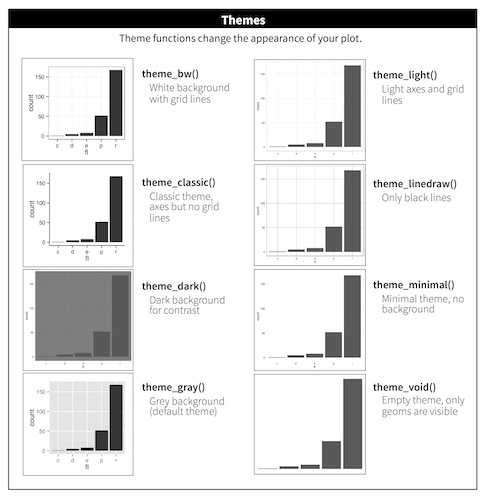

```{r my_opts, cache=FALSE, include=FALSE}
library(knitr)

knit_hooks$set(
  small.mar = function(before, options, envir) {
  if (before)
  par(mar = c(4, 4, .1, .1))  # smaller margin on top and right
  }
  )

opts_chunk$set(fig.align="center", fig.height=5.5, fig.width=6.75, 
               collapse=TRUE, comment="", prompt=TRUE, 
               small.mar=TRUE, cache=TRUE)

options(width=63)

library("ggplot2")
```

# </img>

# A Grammar of Graphics

## Rationale

<p style="font-size: 1em;">
A grammar for communicating data visualization:
</p>

- Data: the data set we are plotting
- Aesthetics: the variation or relationships in the data we want to visualize
- Geometries: the geometric object by which we render the aesthetics
- Coordinates: the coordinate system used (not covered here)
- Facets: the layout of plots required to visualize the data
- Other Options:  any other customizations we wish to make, such as changing the color scheme or labels

<p style="font-size: 1em;">
These are strung together like words in a sentence.
</p>

## Package `ggplot2` 

<p style="font-size: 1em;">
The R package `ggplot2` implements a grammar of graphics along these lines.  First, let's load `ggplot2`:
</p>
```{r, cache=FALSE}
library(ggplot2)
```

<p style="font-size: 1em;">
Now let's set a theme (more on this later):
</p>

```{r, cache=FALSE}
theme_set(theme_bw())
```

## Pieces of the Grammar

- `ggplot()`
- `aes()`
- `geom_*()`
- `facet_*()`
- `scale_*()`
- `theme()`
- `labs()`

<p style="font-size: 1em;">
The `*` is a placeholder for a variety of terms that we will consider.
</p>

## Geometries

<p style="font-size: 1em;">
Perhaps the most important aspect of `ggplot2` is to understand the "geoms". We will cover the following:
</p>

- `geom_bar()`
- `geom_boxplot()`
- `geom_violin()`
- `geom_histogram()`
- `geom_density()`
- `geom_line()`
- `geom_point()`
- `geom_smooth()`
- `geom_hex()`

## Call Format

<p style="font-size: 1em;">
The most basic `ggplot2` plot is made with something like:
</p>

```
ggplot(data = <DATA FRAME>) +
 geom_*(mapping = aes(x = <VAR X>, y = <VAR Y>))
``` 

<p style="font-size: 1em;">
where `<DATA FRAME>` is a data frame and `<VAR X>` and `<VAR Y>` are variables (i.e., columns) from this data frame.  Recall `geom_*` is a placeholder for a geometry such as `geom_boxplot`.
</p>

## Layers

<p style="font-size: 1em;">
There's a complex "layers" construct occurring in the `ggplot2` package. However, for our purposes, it suffices to note that the different parts of the plots are layered together through the `+` operator:
</p>

```{r, eval=FALSE}
ggplot(data = mpg) + 
  geom_point(mapping = aes(x = displ, y = hwy, color=drv)) +
  geom_smooth(mapping = aes(x = displ, y = hwy, color=drv)) + 
  scale_color_brewer(palette = "Set1", name = "Drivetrain") +
  labs(title = "Highway MPG By Drivetrain and Displacement", 
       x = "Displacement", y = "Highway MPG")
```

## Placement of the `aes()` Call

<p style="font-size: 1em;">
In the previous slide, we saw that the same `aes()` call was made for two `geom`'s.  When this is the case, we may more simply call `aes()` from within `ggplot()`:
</p>

```{r, eval=FALSE}
ggplot(data = mpg, mapping = aes(x = displ, y = hwy, color=drv)) + 
  geom_point() +
  geom_smooth() + 
  scale_color_brewer(palette = "Set1", name = "Drivetrain") +
  labs(title = "Highway MPG By Drivetrain and Displacement", 
       x = "Displacement", y = "Highway MPG")
```

<p style="font-size: 1em;">
There may be cases where different `geom`'s are layered and require different `aes()` calls.  This is something to keep in mind as we go through the specifics of the `ggplot2` package.
</p>

## Original Publications

<p style="font-size: 1em;">
Wickham, H. (2010) [A Layered Grammar of Graphics.](http://www.tandfonline.com/doi/abs/10.1198/jcgs.2009.07098) *Journal of Computational and Graphical Statistics*, 19 (1): 3--28.
</p>

<p style="font-size: 1em;">
This paper designs an implementation of *The Grammar of Graphics* by Leland Wilkinson (published in 2005).
</p>

## Documentation

- In R: `help(package="ggplot2")`
- <http://docs.ggplot2.org/current/>
- <http://www.cookbook-r.com/Graphs/>
- [*ggplot2: Elegant Graphics for Data Analysis*](http://amzn.com/0387981403) (somewhat outdated, but gives clear rationale)

# Data Sets

## Data `mpg`

<p style="font-size: 1em;">
Load the `mpg` data set:
</p>

```{r, cache=FALSE, message=FALSE}
library("dplyr") # why load dplyr?
data("mpg", package="ggplot2")
head(mpg)
```

## Data `diamonds`

<p style="font-size: 1em;">
Load the `diamonds` data set:
</p>

```{r, cache=FALSE, message=FALSE}
data("diamonds", package="ggplot2")
head(diamonds)
```


# Barplots

----

The `geom_bar()` layer forms a barplot and only requires an `x` assignment in the `aes()` call:

```{r}
ggplot(data = diamonds) + 
  geom_bar(mapping = aes(x = cut))
```

----

Color in the bars by assigning `fill` in `geom_bar()`, but outside of `aes()`:

```{r}
ggplot(data = diamonds) + 
  geom_bar(mapping = aes(x = cut), fill = "tomato")
```


----

Color *within* the bars according to a variable by assigning `fill` in `geom_bar()` *inside* of `aes()`:


```{r}
ggplot(data = diamonds) + 
  geom_bar(mapping = aes(x = cut, fill = cut))
```

----

When we use `fill = clarity` within `aes()`, we see that it shows the proportion of each `clarity` value within each `cut` value:

```{r}
ggplot(data = diamonds) + 
  geom_bar(mapping = aes(x = cut, fill = clarity))
```

----

By setting `position = "dodge"` outside of `aes()`, it shows bar charts for the `clarity` values within each `cut` value:

```{r}
ggplot(data = diamonds) + 
  geom_bar(mapping= aes(x = cut, fill = clarity), position = "dodge")
```

----

By setting `position = "fill"`, it shows the proportion of `clarity` values within each `cut` value and no longer shows the `cut` values:


```{r}
ggplot(data = diamonds) + 
  geom_bar(mapping=aes(x = cut, fill = clarity), position = "fill") +
  labs(x = "cut", y = "relative proporition within cut")
```

# Boxplots and Violin Plots

----

The `geom_boxplot()` layer forms a boxplot and requires both `x` and `y` assignments in the `aes()` call, even when plotting a single boxplot:

```{r}
ggplot(data = mpg) + 
  geom_boxplot(mapping = aes(x = 1, y = hwy))
```

----

Color in the boxes by assigning `fill` in `geom_boxplot()`, but outside of `aes()`:

```{r}
ggplot(data = mpg) + 
  geom_boxplot(mapping = aes(x = 1, y = hwy), fill="lightblue") +
  labs(x=NULL)
```

----

Show a boxplot for the `y` values occurring within each `x` factor level by making these assignments in `aes()`:

```{r}
ggplot(data = mpg) + 
  geom_boxplot(mapping = aes(x = factor(cyl), y = hwy))
```

----

By assigning the `fill` argument *within* `aes()`, we can color each boxplot according to the x-axis factor variable:

```{r}
ggplot(data = mpg) + 
  geom_boxplot(mapping = aes(x = factor(cyl), y = hwy, 
                             fill = factor(cyl)))
```

----

The `geom_jitter()` function plots the data points and randomly jitters them so we can better see all of the points:

```{r}
ggplot(data = mpg, mapping = aes(x=factor(cyl), y=hwy)) + 
  geom_boxplot(fill = "lightblue") +
  geom_jitter(width = 0.2)
```

----

A violin plot, called via `geom_violin()`, is similar to a boxplot, except shows a density plot turned on its side and reflected across its vertical axis:

```{r}
ggplot(data = mpg) + 
  geom_violin(mapping = aes(x = drv, y = hwy))
```

----

Add a `geom_jitter()` to see how the original data points relate to the violin plots:

```{r}
ggplot(data = mpg, mapping = aes(x = drv, y = hwy)) + 
  geom_violin(adjust=1.2) +
  geom_jitter(width=0.2, alpha=0.5)
```

----

Boxplots made from the `diamonds` data:

```{r}
ggplot(diamonds) + 
  geom_boxplot(mapping = aes(x=color, y=price))
```

----

The analogous violin plots made from the `diamonds` data:

```{r}
ggplot(diamonds) + 
  geom_violin(mapping = aes(x=color, y=price))
```


# Histograms and Density Plots

----

We can create a histogram using the `geom_histogram()` layer, which requires an `x` argument only in the `aes()` call:

```{r, message=FALSE}
ggplot(diamonds) +
  geom_histogram(mapping = aes(x=price))
```

----

We can change the bin width directly in the histogram, which is an intuitive parameter to change based on visual inspection:

```{r}
ggplot(diamonds) +
  geom_histogram(mapping = aes(x=price), binwidth = 1000)
```

----

Instead of counts on the y-axis, we may instead want the area of the bars to sum to 1, like a probability density:

```{r}
ggplot(diamonds) +
  geom_histogram(mapping = aes(x=price, y=..density..), binwidth=1000)
```

----

When we use `fill = cut` within `aes()`, we see that it shows the counts of each `cut` value within each `price` bin:

```{r}
ggplot(diamonds) +
  geom_histogram(mapping = aes(x=price, fill = cut), binwidth = 1000)
```

----

Display a density plot using the `geom_density()` layer:

```{r}
ggplot(diamonds) +
  geom_density(mapping = aes(x=price))
```

----

Employ the arguments `color="blue"` and `fill="lightblue"` outside of the `aes()` call to include some colors:

```{r}
ggplot(diamonds) +
  geom_density(mapping = aes(x=price), color="blue", fill="lightblue")
```

----

By utilizing `color=clarity` we plot a density of `price` stratified by each `clarity` value:

```{r}
ggplot(diamonds) +
  geom_density(mapping = aes(x=price, color=clarity))
```

----

Overlay a density plot and a histogram together:

```{r, message=FALSE}
ggplot(diamonds, mapping = aes(x=price)) + 
  geom_histogram(aes(y=..density..), color="black", fill="white") +
  geom_density(fill="lightblue", alpha=.5)
```

# Line Plots


----

<h2>`babynames` Revisited</h2>

Let's first create a data frame that captures the number of times "John" is registered in males per year:

```{r}
library("babynames")
john <- babynames %>% filter(sex=="M", name=="John")
head(john)
```

----

We can `geom_lines()` to plot a line showing the popularity of "John" over time:

```{r}
ggplot(data = john) + 
  geom_line(mapping = aes(x=year, y=prop), size=1.5)
```

----

Now let's look at a name that occurs nontrivially in males and females:

```{r}
kelly <- babynames %>% filter(name=="Kelly")
ggplot(data = kelly) + 
  geom_line(mapping = aes(x=year, y=prop, color=sex), size=1.5)
```

# Scatterplots

----

The layer `geom_point()` produces a scatterplot, and the `aes()` call requires `x` and `y` assignment:

```{r}
ggplot(data = mpg) + 
  geom_point(mapping = aes(x = displ, y = hwy))
```

----

Give the points a color:

```{r}
ggplot(data = mpg) + 
  geom_point(mapping = aes(x = displ, y = hwy), color = "blue")
  
```

----

Color the points according to a factor variable by including `color = class` within the `aes()` call:

```{r}
ggplot(data = mpg) + 
  geom_point(mapping = aes(x = displ, y = hwy, color = class))
```

----

Increase the size of points with `size=2` outside of the `aes()` call:

```{r}
ggplot(data = mpg) + 
  geom_point(mapping = aes(x = displ, y = hwy, color = class), size=2)
```

----

Vary the size of the points according to the `class` factor variable:

```{r}
ggplot(data = mpg) + 
  geom_point(mapping = aes(x = displ, y = hwy, size = class))
```

----

Vary the transparency of the points according to the `class` factor variable by setting `alpha=class` within the `aes()` call:

```{r}
ggplot(data = mpg) + 
  geom_point(mapping = aes(x = displ, y = hwy, alpha = class))
```

----

Vary the shape of the points according to the `class` factor variable by setting `alpha=class` within the `aes()` call (maximum 6 possible shapes -- oops!):

```{r, warning=FALSE}
ggplot(data = mpg) + 
  geom_point(mapping = aes(x = displ, y = hwy, shape = class))
```

----

Color the points according to the `cut` variable by setting `color=cut` within the `aes()` call:

```{r}
ggplot(data = diamonds) +
  geom_point(mapping = aes(x=carat, y=price, color=cut), alpha=0.7)
```

----

Color the points according to the `clarity` variable by setting `color=clarity` within the `aes()` call:

```{r}
ggplot(data = diamonds) +
  geom_point(mapping=aes(x=carat, y=price, color=clarity), alpha=0.3)
```


----

Override the `alpha=0.3` in the legend:

```{r}
ggplot(data = diamonds) +
  geom_point(mapping=aes(x=carat, y=price, color=clarity), alpha=0.3) + 
  guides(color = guide_legend(override.aes = list(alpha = 1)))
```

# Axis Scales

----

The `price` variable seems to be significantly right-skewed:

```{r}
ggplot(diamonds) + 
  geom_boxplot(aes(x=color, y=price)) 
```

----

We can try to reduce this skewness by rescaling the variables.  We first try to take the `log(base=10)` of the `price` variable via `scale_y_log10()`:

```{r}
ggplot(diamonds) + 
  geom_boxplot(aes(x=color, y=price)) + 
  scale_y_log10()
```

----

Let's repeat this on the analogous violing plots:

```{r}
ggplot(diamonds) + 
  geom_violin(aes(x=color, y=price)) + 
  scale_y_log10()
```

----

The relationship between `carat` and `price` is very nonlinear.  Let's explore different transformations to see if we can find an approximately linear relationship.

```{r}
ggplot(data = diamonds) +
  geom_point(mapping=aes(x=carat, y=price, color=clarity), alpha=0.3)
```

----

First try to take the squareroot of the the `price` variable:

```{r}
ggplot(data = diamonds) +
  geom_point(aes(x=carat, y=price, color=clarity), alpha=0.3) +
  scale_y_sqrt()
```

----

Now let's try to take `log(base=10)` on both the `carat` and `price` variables:

```{r}
ggplot(data = diamonds) +
  geom_point(aes(x=carat, y=price, color=clarity), alpha=0.3) +
  scale_y_log10(breaks=c(1000,5000,10000)) + 
  scale_x_log10(breaks=1:5)
```

----

Forming a violin plot of `price` stratified by `clarity` and transforming the `price` variable yields an interesting relationship in this data set:

```{r}
ggplot(diamonds) + 
  geom_violin(aes(x=clarity, y=price, fill=clarity), adjust=1.5) +  
  scale_y_log10()
```

# Scatterplot Smoothers

----

<h2>Fitting "Smoothers" and Other Models to Scatterplots</h2>

<p style="font-size: 1em;">
- Later this semester, we will spend several weeks learning how to explain or predict an outcome variable in terms of predictor variables  
- We will briefly show here how to plot some simple model fits to scatterplots
- You may want to return to these slides later in the semester once we cover modeling in more detail
</p>

----

Recall the scatterplot showing the relationship between highway mpg and displacement.  How can we plot a smoothed relationship between these two variables?

```{r}
ggplot(data = mpg) + 
  geom_point(mapping = aes(x = displ, y = hwy))
```

----

Plot a smoother with `geom_smooth()` using the default settings (other than removing the error bands):

```{r}
ggplot(data = mpg, mapping = aes(x = displ, y = hwy)) + 
  geom_point() + 
  geom_smooth(se=FALSE)
```

----

The default smoother here is a "loess" smoother. Let's compare that to the least squares regresson line:

```{r}
ggplot(data = mpg, mapping = aes(x = displ, y = hwy)) + 
  geom_point() + 
  geom_smooth(aes(colour = "loess"), method = "loess", se = FALSE) + 
  geom_smooth(aes(colour = "lm"), method = "lm", se = FALSE)
```

----

Now let's plot a smoother to the points stratified by the `drv` variable:

```{r}
ggplot(data=mpg, mapping = aes(x = displ, y = hwy, linetype = drv)) + 
  geom_point() + 
  geom_smooth(se=FALSE)
```

----

Instead of different line types, let's instead differentiate them by line color:

```{r}
ggplot(data = mpg, mapping = aes(x = displ, y = hwy, color=drv)) + 
  geom_point() +
  geom_smooth(se=FALSE)
```

# Overplotting

----

<h2> Definition </h2>

<p style="font-size: 1em;">
- Overplotting occurs when there are many observations, resulting in many objects being plotted on top of each other
- For example, the `diamonds` data set has `r nrow(diamonds)` observations per variable
- Let's explore some ways to deal with overplotting
</p>

----

Here is an example of an overplotted scatterplot:

```{r}
ggplot(data = diamonds, mapping = aes(x=carat, y=price)) +
  geom_point()
```

----

Let's reduce the `alpha` of the points:

```{r}
ggplot(data = diamonds, mapping = aes(x=carat, y=price)) +
  geom_point(alpha=0.1)
```

----

Let's further reduce the `alpha`:

```{r}
ggplot(data = diamonds, mapping = aes(x=carat, y=price)) +
  geom_point(alpha=0.01)
```

----

We can bin the points into hexagons, and report how many points fall within each bin.  We use the `geom_hex()` layer to do this:

```{r}
ggplot(data = diamonds, mapping = aes(x=carat, y=price)) +
  geom_hex()
```

----

Let's try to improve the color scheme:

```{r}
ggplot(data = diamonds, mapping = aes(x=carat, y=price)) +
  geom_hex() + 
  scale_fill_gradient2(low="lightblue", mid="purple", high="black", 
                       midpoint=3000)
```

----

We can combine the scale transformation used earlier with the "hexbin" plotting method:

```{r}
ggplot(data = diamonds, mapping = aes(x=carat, y=price)) +
  geom_hex(bins=20) +
  scale_x_log10(breaks=1:5) + scale_y_log10(breaks=c(1000,5000,10000)) 
```


# Labels and Legends

----

Here's how you can change the axis labels and give the plot a title:

```{r}
ggplot(data = mpg) + 
  geom_boxplot(mapping = aes(x = factor(cyl), y = hwy)) +
  labs(title="Highway MPG by Cylinders",x="Cylinders",y="Highway MPG")
```

----

You can remove the legend to a plot by the following:

```{r}
ggplot(data = diamonds) + 
  geom_bar(mapping = aes(x = cut, fill = cut)) +
  theme(legend.position="none")
```

----

The legend can be placed on the "top", "bottom", "left", or "right":

```{r}
ggplot(data = diamonds) + 
  geom_bar(mapping = aes(x = cut, fill = cut)) +
  theme(legend.position="bottom")
```

----

The legend can be moved inside the plot itself:

```{r}
ggplot(data = diamonds) + 
  geom_bar(mapping = aes(x = cut, fill = cut)) +
  theme(legend.position=c(0.15,0.75))
```

----

Change the name of the legend:

```{r}
ggplot(data = diamonds) + 
  geom_bar(mapping = aes(x = cut, fill = cut)) +
  scale_fill_discrete(name="Diamond\nCut")
```

----

Change the labels within the legend:

```{r}
ggplot(data = diamonds) + 
  geom_bar(mapping = aes(x = cut, fill = cut)) +
  scale_fill_discrete(labels=c("F", "G", "VG", "P", "I"))
```

# Facets

----

Here is the histogram of the `displ` variable from the `mpg` data set:

```{r}
ggplot(mpg) + geom_histogram(mapping=aes(x=displ), binwidth=0.25)
```

----

The `facet_wrap()` layer allows us to stratify the `displ` variable according to `cyl`, and show the histograms for the strata in an organized fashion:
```{r}
ggplot(mpg) + 
  geom_histogram(mapping=aes(x=displ), binwidth=0.25) + 
  facet_wrap(~ cyl)
```

----

Here is `facet_wrap()` applied to `displ` startified by the `drv` variable:

```{r}
ggplot(mpg) + 
  geom_histogram(mapping=aes(x=displ), binwidth=0.25) + 
  facet_wrap(~ drv)
```

----

We can stratify by two variable simultaneously by using the `facet_grid()` layer:

```{r}
ggplot(mpg) + 
  geom_histogram(mapping=aes(x=displ), binwidth=0.25) + 
  facet_grid(drv ~ cyl)
```

----

Let's carry out a similar faceting on the `diamonds` data over the next four plots:

```{r}
ggplot(diamonds) + 
  geom_histogram(mapping=aes(x=price), binwidth=500)
```

----

Stratify `price` by `clarity`:

```{r}
ggplot(diamonds) + 
  geom_histogram(mapping=aes(x=price), binwidth=500) + 
  facet_wrap(~ clarity)
```

----

Stratify `price` by `clarity`, but allow each y-axis range to be different by including the `scale="free_y"` argument:


```{r}
ggplot(diamonds) + 
  geom_histogram(mapping=aes(x=price), binwidth=500) + 
  facet_wrap(~ clarity, scale="free_y")
```

----

Jointly stratify `price` by `cut` and `clarify`:

```{r}
ggplot(diamonds) + 
  geom_histogram(mapping=aes(x=price), binwidth=500) + 
  facet_grid(cut ~ clarity) +
  scale_x_continuous(breaks=9000)
```

# Colors

## Finding Colors

- [A list](http://www.stat.columbia.edu/~tzheng/files/Rcolor.pdf) of named colors in R (e.g., "lightblue")
- [RColorBrewer](https://cran.r-project.org/web/packages/RColorBrewer/index.html) package
- The Crayola crayon colors from the [`broman`](https://cran.r-project.org/web/packages/broman/index.html) package -- use `brocolors(set="crayons")`
- [Color blind palette](http://www.cookbook-r.com/Graphs/Colors_(ggplot2)/): 

```{r} 
cbPalette <- c("#999999", "#E69F00", "#56B4E9", "#009E73", "#F0E442", "#0072B2", 
               "#D55E00", "#CC79A7")
```

## Some Useful Layers

- `scale_fill_manual()`
- `scale_color_manual()`
- `scale_fill_gradient()`
- `scale_color_gradient()`


----

Manually determine colors to fill the barplot using the color blind palette defined above, `cbPalette`:

```{r}
ggplot(data = diamonds) + 
  geom_bar(mapping = aes(x = cut, fill = cut)) +
  scale_fill_manual(values=cbPalette)
```


----

Manually determine point colors using the color blind palette defined above, `cbPalette`:

```{r}
ggplot(data = mpg) + 
  geom_point(mapping = aes(x = displ, y = hwy, color = class), size=2) +
  scale_color_manual(values=cbPalette)
```

----

Fill the histogram bars using a color gradient by their counts, where we determine the endpoint colors:

```{r, message=FALSE}
ggplot(data = mpg) + 
  geom_histogram(aes(x=hwy, fill=..count..)) + 
  scale_fill_gradient(low="blue", high="red")
```

----

Color the points based on a gradient formed from the quantitative variable, `displ`, where we we determine the endpoint colors:

```{r}
ggplot(data = mpg) + 
  geom_point(aes(x=hwy, y=cty, color=displ), size=2) + 
  scale_color_gradient(low="blue", high="red")
```

----

An example of using the palette "Set1" from the `RColorBrewer` package, included in `ggplot2`:

```{r}
ggplot(diamonds) +
  geom_density(mapping = aes(x=price, color=clarity)) +
  scale_color_brewer(palette = "Set1")
```

----

Another example of using the palette "Set1" from the `RColorBrewer` package, included in `ggplot2`:

```{r}
ggplot(data = mpg) + 
  geom_point(mapping = aes(x = displ, y = hwy, color = class)) +
  scale_color_brewer(palette = "Set1")
```

# Saving Plots

## Saving Plots as Variables

Pieces of the plots can be saved as variables, which is particular useful to explortatory data analysis. These all produce the same plot:

```{r, eval=FALSE}
ggplot(data = mpg, mapping = aes(x = displ, y = hwy, color=drv)) + 
  geom_point() +
  geom_smooth(se=FALSE)
```

```{r, eval=FALSE}
p <- ggplot(data = mpg, mapping = aes(x = displ, y = hwy, color=drv)) +  
  geom_point() 
p + geom_smooth(se=FALSE)
```

```{r, eval=FALSE}
p <- ggplot(data = mpg, mapping = aes(x = displ, y = hwy, color=drv)) 
p +  geom_point() + geom_smooth(se=FALSE)
```

Try it yourself!

## Saving Plots to Files

Plots can be saved to many formats using the `ggsave()` function.  Here are some examples:

```{r, eval=FALSE}
p <- ggplot(data = mpg, mapping = aes(x = displ, y = hwy, color=drv)) + 
  geom_point() +
  geom_smooth(se=FALSE)
ggsave(filename="my_plot.pdf", plot=p) # saves PDF file
ggsave(filename="my_plot.png", plot=p) # saves PNG file
```

Here are the arguments that `ggsave()` takes:
```{r}
str(ggsave)
```

# Themes

## Available Themes

<center></center>

From <http://r4ds.had.co.nz/visualize.html>.  See also [`ggthemes`](https://cran.r-project.org/web/packages/ggthemes/index.html) package.

## Setting a Theme

<p style="font-size: 1em;">
Globally:
</p>

```{r, eval=FALSE}
theme_set(theme_minimal())
```

<p style="font-size: 1em;">
Locally: 
</p>

```{r, eval=FALSE}
ggplot(data = diamonds) + 
  geom_bar(mapping = aes(x = cut)) + 
  theme_minimal()
```


# Extras

## License

<p style="font-size: 1em;">
<https://github.com/SML201/lectures/blob/master/LICENSE.md>
</p>

## Source Code

<p style="font-size: 1em;">
<https://github.com/SML201/lectures/tree/master/week5>
</p>

## Session Information

<section style="font-size: 0.75em;">
```{r}
sessionInfo()
```
</section>

```{r converttonotes, include=FALSE, cache=FALSE}
source("../customization/make_notes.R")
```
