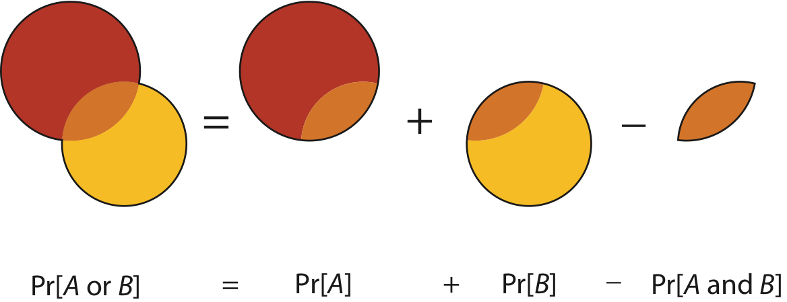

```{r my_opts, cache=FALSE, include=FALSE}
library(knitr)
knit_hooks$set(small.mar = function(before, options, envir) {
    if (before) par(mar = c(4, 4, .1, .1))  # smaller margin on top and right
})
opts_chunk$set(fig.align="center", fig.height=5.5, fig.width=6.75, collapse=TRUE, comment="", prompt=TRUE, small.mar=TRUE)
options(width=63)
library(ggplot2)
theme_set(theme_bw())
set.seed(201)
```


# Probability and Statistics

## Roles In Data Science

Probability and statistics are required in data science whenever the goals include:

1.  Characterizing randomness or "noise" in the data
2.  Quantifying uncertainty in models we build or decisions we make from the data
3.  Predicting future observations or decisions in the face of uncertainty

## Central Dogma of Inference

<center></center>

## Data Analysis Without Probability

It is possible to do data analysis without probability and formal statistical inference.  

Exploratory data analysis and visualization tend to not involve probability or formal statistical inference.

Important problems machine learning do not involve probability or statistical inference.

Recall Figure 2.1 from *Elements of Data Analytic Style* (shown in Week 1).

# Probability

## Sample Space

- The **sample space** $S$ is the set of all **outcomes**
- We are interested in calculating probabilities on relevant subsets of this space, called **events**: $A \subseteq S$
- Examples ---
    - Two coin flips: $S =$ {HH, HT, TH, TT}
    - Netflix movie rating: $S =$ {1, 2, 3, 4, 5}
    - Number of lightning strikes on campus: $S =$ {0, 1, 2, 3, ...}
    - Height of adult humans in meters: $S = [0, \infty)$

## Sample Spaces We Consider

- $S$ = {1, 2, ..., $n$}
- $S$ = {0, 1, 2, 3, ...}
- $S$ = [0, $\infty$)
- $S$ = $\mathbb{R}$ = (-$\infty$, $\infty$)

## Mathematical Probability

1. The probability of any even $A$ is such that $0 \leq {\rm Pr}(A) \leq 1$
2. If $S$ is the sample space then ${\rm Pr}(S)=1$
3. Let $A^c$ be all outcomes from $S$ that are not in $A$ (called the *complement*); then ${\rm Pr}(A) + {\rm Pr}(A^c) = 1$
4. If $A \mbox{ and } B = \varnothing$, then ${\rm Pr}(A \mbox{ or } B) = {\rm Pr}(A) + {\rm Pr}(B)$, where $\varnothing$ is the empty set

## Two Events

<center></center>

## Conditional Probability

An important calclation in probability and statistics is the conditional probability.  We can consider the probability of an event $A$, conditional on the fact that we are restricted to be within event $B$.  This is defined as:

$${\rm Pr}(A | B) = \frac{\operatorname{Pr}(A \mbox{ and } B)}{\operatorname{Pr}(B)}$$

## Independence

Two events $A$ and $B$ by definition independent when:

- ${\rm Pr}(A | B) = {\rm Pr}(A)$
- ${\rm Pr}(B | A) = {\rm Pr}(B)$
- ${\rm Pr}(A \mbox{ and } B) = {\rm Pr}(A) {\rm Pr}(B)$

All three of these are equivalent.

## Bayes Theorem

A common approach in statistics is to obtain a conditional probability of two events through the opposite conditional probability and their marginal probability. This is called Bayes Theorem:

$${\rm Pr}(B | A) = \frac{\operatorname{Pr}(A | B){\rm Pr}(B)}{\operatorname{Pr}(A)}$$

# Random Variables

## Definition

We will define a **random variable** (rv) to be a variable that takes values according to a probability distribution.

We define a random variable through its **probability mass function** (pmf) for discrete rv's or its **probability density function** (pdf) for continuous rv's.  We can also define it through its **cumulative distribution function** (cdf).  The pmf/pdf determines the cdf, and vice versa.

Note: There's a more technical and rigorous definition of a rv, but it does not affect how we will use random variables.

## Discrete Random Variables

A discrete rv $X$ takes on a discrete set of values such as $S$ = {1, 2, ..., $n$} or $S$ = {0, 1, 2, 3, ...}. 

Its distribution is characterized by its pmf: $$f(x) = {\rm Pr}(X = x) \mbox{ for } x \in S.$$

Its cdf is: $$F(y) = {\rm Pr}(X \leq y) = \sum_{x \leq y} {\rm Pr}(X = x).$$

## Continuous Random Variables

A continuous rv $X$ takes on a continuous set of values such as $S$ = [0, $\infty$) or $S$ = $\mathbb{R}$ = (-$\infty$, $\infty$).

The probability $X$ takes on any specific value is 0.  Its pdf $f(x)$ therefore gives an infinitesimal, local, relative probability.

For $S$ = (-$\infty$, $\infty$), its cdf is: $$F(y) = {\rm Pr}(X \leq y) = \int_{-\infty}^y f(x) dx.$$

When $S$ = [0, $\infty$), the integral starts at 0.

## Example: Discrete PMF

```{r, echo=FALSE}
x <- 0:10
z <- data.frame(x=x, y=dbinom(x, prob=0.4, size=10))
ggplot(z, aes(x=x, y=y)) +
  geom_segment(aes(xend = x, yend = 0), size = 1.5, lineend = "round",
               color="lightgray") + 
  geom_point(size=2) + 
  scale_x_continuous(breaks=0:10) +
  labs(x="x", y="f(x)")
```

## Example: Discrete CDF

```{r, echo=FALSE}
df <- data.frame(x=0:9, y=pbinom(0:9, prob=0.4, size=10), 
                 xo=1:10, yo=pbinom(0:9, prob=0.4, size=10))
ggplot(data=df) +
  geom_segment(aes(x=x, y=y, xend = xo, yend = yo), size=1.5) +
  geom_point(aes(x=xo, y=yo), color="white", size=2) +
  geom_point(aes(x=xo, y=yo), shape=1, size=2) +
  geom_point(aes(x=x, y=y), size=2) +
  scale_x_continuous(breaks=0:10) +
  labs(x="y", y="F(y)")
```


## Probabilities of Events Via Discrete CDF

Examples: 

| Probability | CDF   | PMF   |
| :---------- | :---- | :---- |
| ${\rm Pr}(X \leq b)$ | $F(b)$ | $\sum_{x \leq b} f(x)$ |
| ${\rm Pr}(X \geq a)$ | $1-F(a-1)$ | $\sum_{x \geq a} f(x)$ |
| ${\rm Pr}(X > a)$ | $1-F(a)$ | $\sum_{x > a} f(x)$ |
| ${\rm Pr}(a \leq X \leq b)$ | $F(b) - F(a-1)$ | $\sum_{a \leq x \leq b} f(x)$ |
| ${\rm Pr}(a < X \leq b)$ | $F(b) - F(a)$ | $\sum_{a < x \leq b} f(x)$ |

## Example: Continuous PDF

```{r, echo=FALSE}
x <- seq(-3.5,3.5,0.01)
z <- data.frame(x=x, y=dnorm(x))
ggplot(z) + geom_line(aes(x=x,y=y), size=1.5) + labs(x="x", y="f(x)")
```

## Example: Continuous CDF

```{r, echo=FALSE}
x <- seq(-3.5,3.5,0.01)
z <- data.frame(x=x, y=pnorm(x))
ggplot(z) + geom_line(aes(x=x,y=y), size=1.5) + labs(x="y", y="F(y)")
```

## Probabilities of Events Via Continuous CDF

Examples: 

| Probability | CDF   | PDF   |
| :---------- | :---- | :---- |
| ${\rm Pr}(X \leq b)$ | $F(b)$ | $\int_{-\infty}^{b} f(x) dx$ |
| ${\rm Pr}(X \geq a)$ | $1-F(a)$ | $\int_{a}^{\infty} f(x) dx$ |
| ${\rm Pr}(X > a)$ | $1-F(a)$ | $\int_{a}^{\infty} f(x) dx$ |
| ${\rm Pr}(a \leq X \leq b)$ | $F(b) - F(a)$ | $\int_{a}^{b} f(x) dx$ |
| ${\rm Pr}(a < X \leq b)$ | $F(b) - F(a)$ | $\int_{a}^{b} f(x) dx$ |

## Example: Continuous RV Event

```{r, echo=FALSE}
x <- seq(-3.5,3.5,0.01)
x1 <- seq(-1,2,length.out=length(x))
z <- data.frame(x=x, y=dnorm(x), x1=x1, y1=dnorm(x1))
ggplot(z) + 
  geom_area(aes(x=x1, y=y1), fill="tomato") +
  geom_line(aes(x=x,y=y), size=1.5) + 
  scale_x_continuous(breaks=-3:3) + 
  labs(x="x", y="f(x)", title=expression(Pr(-1<=~X<=~2)))
```

## Note on PMFs and PDFs

PMFs and PDFs are defined as zero outside of the sample space $S$. That is: 

$$f(x) = 0 \mbox{ for } x \not\in S$$

Also, they sum or integrate to 1:

$$\sum_{x \in S} f(x) = 1$$

$$\int_{x \in S} f(x) dx = 1$$

## Sample Vs Population Statistics

We earlier discussed measures of center and spread for a set of data, such as the mean and the variance.  

Analogous measures exist for probability distributions.  

These are two types are distinguished by calling those on data "sample" measures and those on probability distributions "population" measures.  

## Expected Value

The **expected value**, also called the "population mean", is a measure of center for a rv.  It is calculated in a fashion analogous to the sample mean:

$${\rm E}[X] = \sum_{x \in S} x \  f(x) \ \ \ \ \mbox{(discrete)}$$

$${\rm E}[X] = \int_{-\infty}^{\infty} x \  f(x) \  dx \ \ \ \ \mbox{(continuous)}$$

## Variance

The **variance**, also called the "population variance", is a measure of spread for a rv.  It is calculated in a fashion analogous to the sample variance:

$${\rm Var}(X) = {\rm E} \left[\left(X-{\rm E}[X]\right)^2\right]; \quad \quad {\rm SD}(X) = \sqrt{{\rm Var}(X)}$$

$${\rm Var}(X) = \sum_{x \in S} \left(x-{\rm E}[X]\right)^2 \ f(x) \ \ \ \ \mbox{(discrete)}$$

$${\rm Var}(X) = \int_{-\infty}^{\infty} \left(x-{\rm E}[X]\right)^2 \ f(x) \  dx \ \ \ \ \mbox{(continuous)}$$

## Random Variables in R

The pmf/pdf, cdf, quantile function, and random number generator for many important random variables are built into R.  They all follow the form, where `<name>` is replaced with the name used in R for each specific distribution:

- `d<name>`: pmf or pdf
- `p<name>`: cdf
- `q<name>`: quantile function or inverse cdf
- `r<name>`: random number generator

To see a list of random variables, type `?Distributions` in R. 

# Discrete RVs

## Uniform (Discrete)

This simple rv distribution assigns equal probabilities to a finite set of values:

$$X \sim \mbox{Uniform}\{1, 2, \ldots, n\}$$

$$S = \{1, 2, \ldots, n\}$$

$$f(x) = 1/n \mbox{ for } x \in S$$

$${\rm E}[X] = \frac{n+1}{2}, \ {\rm Var}(X) = \frac{n^2-1}{12}$$

## Uniform (Discrete) PMF

```{r, echo=FALSE}
x <- 1:10
z <- data.frame(x=x, y=rep(1/length(x), length(x)))
ggplot(z, aes(x=x, y=y)) +
  geom_segment(aes(xend = x, yend = 0), size = 1.5, lineend = "round",
               color="lightgray") + 
  geom_point(size=2) + 
  scale_x_continuous(breaks=0:10) +
  labs(x="x", y="f(x)")
```


## Uniform (Discrete) in R

There is no family of functions built into R for this distribution since it is so simple.  However, it is possible to generate random values via the `sample` function:

```{r}
n <- 20L
sample(x=1:n, size=10, replace=TRUE)

x <- sample(x=1:n, size=1e6, replace=TRUE)
mean(x) - (n+1)/2
var(x) - (n^2-1)/12
```

## Binomial

$$X \sim \mbox{Binomial}(n, p)$$

$$S = \{1, 2, \ldots, n\}$$

$$f(x) = {n \choose x} p^x (1-p)^{n-x} \mbox{ for } x \in S$$

$${\rm E}[X] = np, \ {\rm Var}(X) = np(1-p)$$

Note that ${n \choose x} = \frac{n!}{x! (n-x)!}$ is the number of unique ways to choose $x$ items from $n$ without respect to order.

## Binomial PMF

```{r, echo=FALSE}
x <- 0:10
z <- data.frame(x=x, y=dbinom(x, prob=0.4, size=10))
ggplot(z, aes(x=x, y=y)) +
  geom_segment(aes(xend = x, yend = 0), size = 1.5, lineend = "round",
               color="lightgray") + 
  geom_point(size=2) + 
  scale_x_continuous(breaks=0:10) +
  labs(x="x", y="f(x)", title=expression(paste(italic(n) == 10, ", ", italic(p) == 0.4)))
```

## Binomial in R

```{r}
str(dbinom)
```

```{r}
str(pbinom)
```

```{r}
str(qbinom)
```

```{r}
str(rbinom)
```

## Poisson

$$X \sim \mbox{Poisson}(\lambda)$$

$$S = \{0, 1, 2, 3, \ldots \}$$

$$f(x) = \frac{\lambda^x e^{-\lambda}}{x!} \mbox{ for } x \in S$$

$${\rm E}[X] = \lambda, \ {\rm Var}(X) = \lambda$$

## Poisson PMF

```{r, echo=FALSE}
x <- 0:20
z <- data.frame(x=x, y=dpois(x, lambda=6))
ggplot(z, aes(x=x, y=y)) +
  geom_segment(aes(xend = x, yend = 0), size = 1.5, lineend = "round",
               color="lightgray") + 
  geom_point(size=2) + 
  scale_x_continuous(breaks=seq(0,20,4)) +
  labs(x="x", y="f(x)", title=expression(lambda == 6))
```

## Poisson in R

```{r}
str(dpois)
```

```{r}
str(ppois)
```

```{r}
str(qpois)
```

```{r}
str(rpois)
```

# Continuous RVs

## Uniform (Continuous)

$$X \sim \mbox{Uniform}(0,1)$$

$$S = [0,1]$$

$$f(x) = 1 \mbox{ for } x \in S$$

$$F(y) = y \mbox{ for } y \in S$$

$${\rm E}[X] = 1/2, \ {\rm Var}(X) = 1/12$$

## Uniform (Continuous) PDF

```{r, echo=FALSE}
x <- seq(0,1,0.01)
z <- data.frame(x=x, y=dunif(x))
ggplot(data=z) +
  geom_line(aes(x=x, y=y), size=1.5) + 
  scale_x_continuous(breaks=seq(0,1,0.2)) +
  labs(x="x", y="f(x)")
```

## Uniform (Continuous) in R

```{r}
str(dunif)
```

```{r}
str(punif)
```

```{r}
str(qunif)
```

```{r}
str(runif)
```

## Exponential

$$X \sim \mbox{Exponential}(\lambda)$$

$$S = [0, \infty)$$

$$f(x) = \lambda e^{-\lambda x} \mbox{ for } x \in S$$

$$F(y) = 1 - e^{-\lambda y} \mbox{ for } y \in S$$

$${\rm E}[X] = \frac{1}{\lambda}, \ {\rm Var}(X) = \frac{1}{\lambda^2}$$

## Exponential PDF

```{r, echo=FALSE}
x <- seq(0,3,0.01)
z <- data.frame(x=x, y=dexp(x, rate=2))
ggplot(data=z) +
  geom_line(aes(x=x, y=y), size=1.5) + 
  labs(x="x", y="f(x)", title=expression(lambda == 2))
```

## Exponential in R

```{r}
str(dexp)
```

```{r}
str(pexp)
```

```{r}
str(qexp)
```

```{r}
str(rexp)
```

## Normal

$$X \sim \mbox{Normal}(\mu, \sigma^2)$$

$$S = (-\infty, \infty)$$

$$f(x) = \frac{1}{\sqrt{2 \pi \sigma^2}} e^{-\frac{(x-\mu)^2}{2 \sigma^2}} \mbox{ for } x \in S$$

$${\rm E}[X] = \mu, \ {\rm Var}(X) = \sigma^2$$

## Normal PDF

```{r, echo=FALSE}
x <- seq(-3.5, 3.5, 0.01)
z <- data.frame(x=x, y=dnorm(x))
ggplot(data=z) +
  geom_line(aes(x=x, y=y), size=1.5) + 
  labs(x="x", y="f(x)", title=expression(paste(mu == 0, ", ", sigma^2 == 1)))
```

## Normal in R

```{r}
str(dnorm) #notice it requires the STANDARD DEVIATION, not the variance
```

```{r}
str(pnorm)
```

```{r}
str(qnorm)
```

```{r}
str(rnorm)
```

# Central Limit Theorem

## Linear Transformation of a RV

Suppose that $X$ is a random variable and that $a$ and $b$ are constants.  Then:

$${\rm E}\left[a + bX \right] = a + b {\rm E}[X]$$

$${\rm Var}\left(a + bX \right) = b^2 {\rm Var}(X)$$


## Sums of Random Variables

If $X_1, X_2, \ldots, X_n$ are independent and identically distributed (iid) random variables, then:

$${\rm E}\left[ \sum_{i=1}^n X_i \right] = \sum_{i=1}^n {\rm E}[X_i]$$

$${\rm Var}\left( \sum_{i=1}^n X_i \right) = \sum_{i=1}^n {\rm Var}(X_i)$$

## Means of Random Variables

Suppose $X_1, X_2, \ldots, X_n$ are independent and identically distributed (iid) random variables. Let $\overline{X} = \frac{1}{n} \sum_{i=1}^n X_i$ be their sample mean.  Then:

$${\rm E}\left[\overline{X}\right] = {\rm E}[X_i]$$

$${\rm Var}\left(\overline{X}\right) = \frac{1}{n}{\rm Var}(X_i)$$

## Statement of the CLT

Suppose $X_1, X_2, \ldots, X_n$ are iid rv's with population mean ${\rm E}[X_i] = \mu$ and variance ${\rm Var}(X_i) = \sigma^2$.  

Then for "large $n$", $\sqrt{n}(\overline{X} - \mu)$ approximately follows the Normal(0, $\sigma^2$) distribution.

As $n \rightarrow \infty$, this approximation becomes exact.

## Example: Calculations

Let $X_1, X_2, \ldots, X_{40}$ be iid Poisson($\lambda$) with $\lambda=6$.

We will form $\sqrt{40}(\overline{X} - 6)$ over 10,000 realizations and compare their distribution to a Normal(0, 6) distribution.

```{r}
x <- replicate(n=1e4, expr=rpois(n=40, lambda=6), 
               simplify="matrix")
x_bar <- apply(x, 2, mean)
clt <- sqrt(40)*(x_bar - 6)

df <- data.frame(clt=clt, x = seq(-18,18,length.out=1e4), 
                 y = dnorm(seq(-18,18,length.out=1e4), 
                           sd=sqrt(6)))
```

## Example: Plot

```{r}
ggplot(data=df) +
  geom_histogram(aes(x=clt, y=..density..), color="blue", 
                 fill="lightgray", binwidth=0.75) +
  geom_line(aes(x=x, y=y), size=1.5)
```

# Statistical Inference

## Data Collection as a Probability

- Suppose data are collected in such a way that it is randomly observed according to a probability distribution
- If that probability distribution can be parameterized, then it is possible that the parameters describe key characteristics of the population of interest
- **Statistical inference** reverse engineers this process to estimate the unknown values of the parameters and express a measure of uncertainty about these estimates

## Parameters and Statistics

- A **parameter** is a number that describes a population
    - A parameter is often a fixed number
    - We usually do not know its value  
- A **statistic** is a number calculated from a sample of data
- A statistic is used to estimate a parameter

## Sampling Distribution

The **sampling distribution** of a statistic is the probability disribution of the statistic under repeated realizations of the data from the assumed data generating probability distribution.

*The sampling distribution is how we connect an observed statistic to the population.*

## Example: Fair Coin?

Suppose I claim that a specific coin is fair, i.e., that it lands on heads or tails with equal probability. 

I flip it 20 times and it lands on heads 16 times.

1. My data is $x=16$ heads out of $n=20$ flips.
2. My data generation model is $X \sim \mbox{Binomial}(20, p)$.
3. I form the statistic $\hat{p} = 16/20$ as an estimate of $p$.

## Example (cont'd)

Let's simulate 10,000 times what my estimate would look like if $p=0.5$ and I repeated the 20 coin flips over and over.  

```{r}
x <- replicate(n=1e4, expr=rbinom(1, size=20, prob=0.5))
sim_p_hat <- x/20
my_p_hat <- 16/20
```

What can I do with this information?

## Example (cont'd)
```{r, echo=FALSE}
df <- data.frame(x=sim_p_hat)
ggplot(data=df, aes(x=x)) + 
  geom_histogram(color="blue", fill="lightgray", binwidth=0.05) + 
  geom_vline(xintercept=my_p_hat, size=1.5) +
  labs(title="Histogram of Sampling Distribution") +
  geom_text(aes(my_p_hat, 1500, label="p_hat"), nudge_x=0.05)
```

## Central Dogma of Inference

<center></center>

# Extras

## License

<https://github.com/SML201/lectures/blob/master/LICENSE.md>

## Source Code

<https://github.com/SML201/lectures/tree/master/week6>

## Session Information

<section style="font-size: 0.75em;">
```{r}
sessionInfo()
```
</section>

