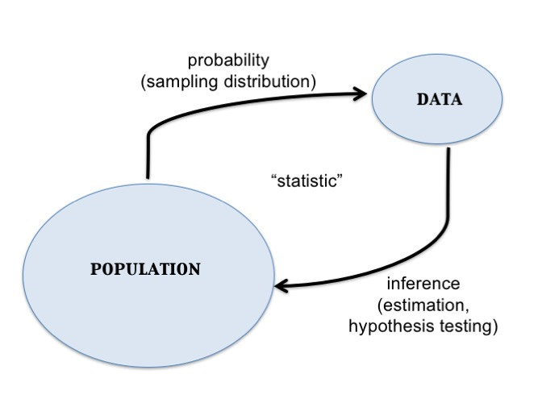
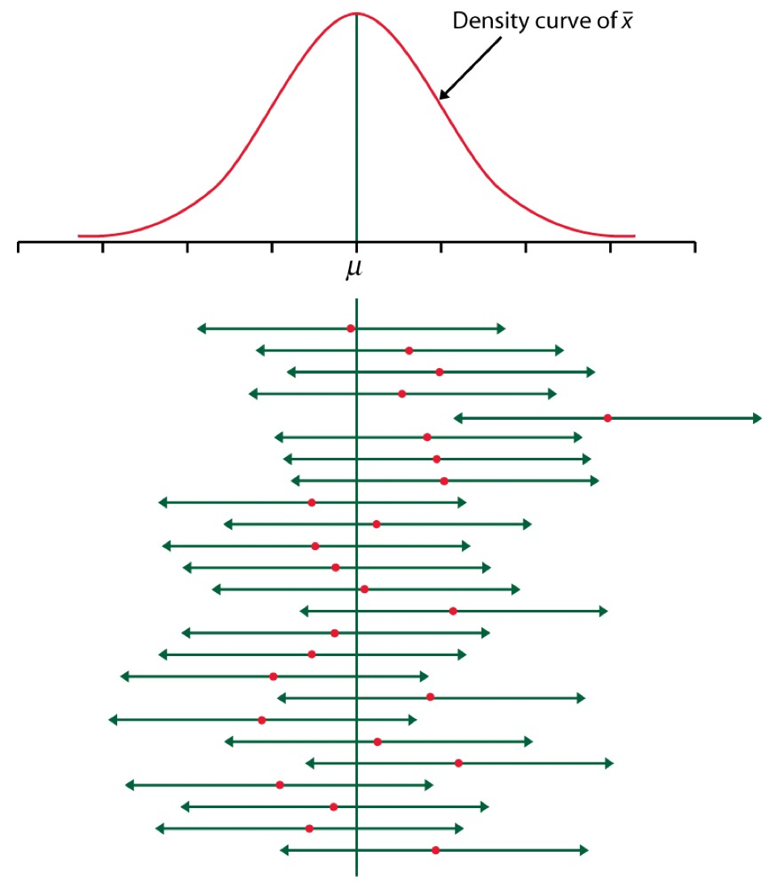
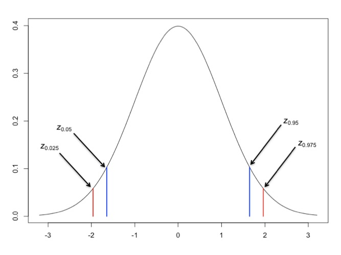

```{r my_opts, cache=FALSE, include=FALSE}
library(knitr)
knit_hooks$set(small.mar = function(before, options, envir) {
    if (before) par(mar = c(4, 4, .1, .1))  # smaller margin on top and right
})
opts_chunk$set(fig.align="center", fig.height=5.5, fig.width=6.75, collapse=TRUE, comment="", prompt=TRUE, small.mar=TRUE)
options(width=63)
library(ggplot2)
theme_set(theme_bw())
set.seed(201)
```

# </img>

# Central Limit Theorem

## Linear Transformation of a RV

Suppose that $X$ is a random variable and that $a$ and $b$ are constants.  Then:

$${\rm E}\left[a + bX \right] = a + b {\rm E}[X]$$

$${\rm Var}\left(a + bX \right) = b^2 {\rm Var}(X)$$


## Sums of Random Variables

If $X_1, X_2, \ldots, X_n$ are independent and identically distributed (iid) random variables, then:

$${\rm E}\left[ \sum_{i=1}^n X_i \right] = \sum_{i=1}^n {\rm E}[X_i]$$

$${\rm Var}\left( \sum_{i=1}^n X_i \right) = \sum_{i=1}^n {\rm Var}(X_i)$$

## Means of Random Variables

Suppose $X_1, X_2, \ldots, X_n$ are independent and identically distributed (iid) random variables. Let $\overline{X} = \frac{1}{n} \sum_{i=1}^n X_i$ be their sample mean.  Then:

$${\rm E}\left[\overline{X}\right] = {\rm E}[X_i]$$

$${\rm Var}\left(\overline{X}\right) = \frac{1}{n}{\rm Var}(X_i)$$

## Statement of the CLT

Suppose $X_1, X_2, \ldots, X_n$ are iid rv's with population mean ${\rm E}[X_i] = \mu$ and variance ${\rm Var}(X_i) = \sigma^2$.  

Then for "large $n$", $\sqrt{n}(\overline{X} - \mu)$ approximately follows the Normal(0, $\sigma^2$) distribution.

As $n \rightarrow \infty$, this approximation becomes exact.

## Example: Calculations

Let $X_1, X_2, \ldots, X_{40}$ be iid Poisson($\lambda$) with $\lambda=6$.

We will form $\sqrt{40}(\overline{X} - 6)$ over 10,000 realizations and compare their distribution to a Normal(0, 6) distribution.

```{r clt_demo, cache=TRUE}
x <- replicate(n=1e4, expr=rpois(n=40, lambda=6), 
               simplify="matrix")
x_bar <- apply(x, 2, mean)
clt <- sqrt(40)*(x_bar - 6)

df <- data.frame(clt=clt, x = seq(-18,18,length.out=1e4), 
                 y = dnorm(seq(-18,18,length.out=1e4), 
                           sd=sqrt(6)))
```

## Example: Plot

```{r clt_plot, cache=TRUE}
ggplot(data=df) +
  geom_histogram(aes(x=clt, y=..density..), color="blue", 
                 fill="lightgray", binwidth=0.75) +
  geom_line(aes(x=x, y=y), size=1.5)
```

# Statistical Inference

## Data Collection as a Probability

- Suppose data are collected in such a way that it is randomly observed according to a probability distribution
- If that probability distribution can be parameterized, then it is possible that the parameters describe key characteristics of the population of interest
- **Statistical inference** reverse engineers this process to estimate the unknown values of the parameters and express a measure of uncertainty about these estimates

## Example: Simple Random Sample

Individuals are uniformly and independently randomly sampled from a population.

The measurements taken on these individuals are then modeled as random variables, specifically random realizations from the complete population of values.

Simple random samples form the basis of modern surveys.

## Example: Randomized Controlled Trial

Individuals under study are randomly assigned to one of two or more available treatments.

This induces randomization directly into the study and breaks the relationship between the treatments and other variables that may be influencing the response of interest.

This is the gold standard study design in clinical trials to assess the evidence that a new drug works on a given disease.

## Parameters and Statistics

- A **parameter** is a number that describes a population
    - A parameter is often a fixed number
    - We usually do not know its value  
- A **statistic** is a number calculated from a sample of data
- A statistic is used to estimate a parameter

## Sampling Distribution

The **sampling distribution** of a statistic is the probability disribution of the statistic under repeated realizations of the data from the assumed data generating probability distribution.

*The sampling distribution is how we connect an observed statistic to the population.*

## Example: Fair Coin?

Suppose I claim that a specific coin is fair, i.e., that it lands on heads or tails with equal probability. 

I flip it 20 times and it lands on heads 16 times.

1. My data is $x=16$ heads out of $n=20$ flips.
2. My data generation model is $X \sim \mbox{Binomial}(20, p)$.
3. I form the statistic $\hat{p} = 16/20$ as an estimate of $p$.

## Example (cont'd)

Let's simulate 10,000 times what my estimate would look like if $p=0.5$ and I repeated the 20 coin flips over and over.  

```{r sampling_demo, cache=TRUE}
x <- replicate(n=1e4, expr=rbinom(1, size=20, prob=0.5))
sim_p_hat <- x/20
my_p_hat <- 16/20
```

What can I do with this information?

## Example (cont'd)
```{r sampling_plot, cache=TRUE, echo=FALSE}
df <- data.frame(x=sim_p_hat)
ggplot(data=df, aes(x=x)) + 
  geom_histogram(color="blue", fill="lightgray", binwidth=0.05) + 
  geom_vline(xintercept=my_p_hat, size=1.5) +
  labs(title="Histogram of Sampling Distribution") +
  geom_text(aes(my_p_hat, 1500, label="p_hat"), nudge_x=0.05)
```

## Central Dogma of Inference

<center></center>

# Inference Goals and Strategies

## Basic Idea

Data are collected in such a way that there exists a reasonable probability model for this process that involves parameters informative about the population.  

Common Goals:

1. Form point estimates the parameters
2. Quantify uncertainty on the estimates
3. Test hypotheses on the parameters

## Normal Example

Suppose a simple random sample of $n$ data points is collected so that the following model of the data is reasonable: $X_1, X_2, \ldots, X_n$ are iid Normal($\mu$, $\sigma^2$).

The goal is to do inference on $\mu$, the population mean.

For simplicity, assume that $\sigma^2$ is known (e.g., $\sigma^2 = 1$).

## Point Estimate of $\mu$

There are a number of ways to form an estimate of $\mu$, but one that has several justifications is the sample mean:

$$\hat{\mu} = \overline{x} = \frac{1}{n}\sum_{i=1}^n x_i,$$

where $x_1, x_2, \ldots, x_n$ are the observed data points.

## Sampling Distribution of $\hat{\mu}$

If we were to repeat this study over and over, how would $\hat{\mu}$ behave?

$$\hat{\mu} = \overline{X} = \frac{1}{n}\sum_{i=1}^n X_i$$

$$\overline{X} \sim \mbox{Normal}(\mu, \sigma^2/n)$$

How do we use this to quantify uncertainty and test hypotheses?

## Pivotal Statistic

One *very useful* strategy is to work backwards from a pivotal statistic, which is a statistic that does not depend on any unknown paramaters.

Example:

$$\frac{\overline{X} - \mu}{\sigma/\sqrt{n}} \sim \mbox{Normal}(0,1)$$

Note that in general for a rv $Y$ it is the case that $(Y - \operatorname{E}[Y])/\sqrt{\operatorname{Var}(Y)}$ has population mean 0 and variance 1.

# Confidence Intervals

## Goal

Once we have a point estimate of a parameter, we would like a measure of its uncertainty.

Given that we are working within a probabilistic framework, the natural language of uncertainty is through probability statements.

We interpret this measure of uncertainty in terms of hypothetical repetitions of the sampling scheme we used to collect the original data set.

## Formulation

Confidence intervals take the form

$$(\hat{\mu} - C_{\ell}, \hat{\mu} + C_{u})$$

where

$${\rm Pr}(\mu - C_{\ell} \leq \hat{\mu} \leq \mu + C_{u})$$

forms the "level" or coverage probability of the interval.

## Interpretation

If we repeat the study many times, then the CI $(\hat{\mu} - C_{\ell}, \hat{\mu} + C_{u})$ will contain the true value $\mu$ with a long run frequency equal to ${\rm Pr}(\mu - C_{\ell} \leq \hat{\mu} \leq \mu + C_{u})$.

A CI is *not* intepreted as: "There is probability ${\rm Pr}(\mu - C_{\ell} \leq \hat{\mu} \leq \mu + C_{u})$ that $\mu$ is in our calculated $(\hat{\mu} - C_{\ell}, \hat{\mu} + C_{u})$."  Why?

----

<center></center>

## A Normal CI

If $Z \sim$ Normal(0,1), then ${\rm Pr}(-1.96 \leq Z \leq 1.96) = 0.95.$

\begin{eqnarray}
0.95 & = & {\rm Pr} \left(-1.96 \leq \frac{\hat{\mu} - \mu}{\sigma/\sqrt{n}} \leq 1.96 \right) \\
\ & = & {\rm Pr} \left(-1.96 \frac{\sigma}{\sqrt{n}} \leq \hat{\mu} - \mu \leq 1.96\frac{\sigma}{\sqrt{n}} \right) \\
\ & = & {\rm Pr} \left(\mu-1.96\frac{\sigma}{\sqrt{n}} \leq \hat{\mu} \leq \mu+1.96\frac{\sigma}{\sqrt{n}} \right)
\end{eqnarray}

Therefore, $\left(\hat{\mu} - 1.96\frac{\sigma}{\sqrt{n}}, \hat{\mu} + 1.96\frac{\sigma}{\sqrt{n}}\right)$ forms a 95% confidence interval of $\mu$.

## A Simulation

```{r}
mu <- 5
n <- 20
x <- replicate(10000, rnorm(n=n, mean=mu)) # 10000 studies
m <- apply(x, 2, mean) # the estimate for each study
ci <- cbind(m - 1.96/sqrt(n), m + 1.96/sqrt(n))
head(ci)
```

```{r}
cover <- (mu > ci[,1]) & (mu < ci[,2])
mean(cover)
```

## Normal$(0,1)$ Percentiles

Above we constructed a 95% CI.  How do we construct (1-$\alpha$)-level CIs?

Let $z_{\alpha}$ be the $\alpha$ percentile of the Normal(0,1) distribution.

If $Z \sim$ Normal(0,1), then 

\begin{eqnarray*}
1-\alpha & = & {\rm Pr}(z_{\alpha/2} \leq Z \leq z_{1-\alpha/2}) \\
\ & = & {\rm Pr}(-|z_{\alpha/2}| \leq Z \leq |z_{\alpha/2}|)
\end{eqnarray*}

```{r}
qnorm(0.025)
qnorm(0.975)
```

## Commonly Used Percentiles

<center></center>

## $(1-\alpha)$-Level CIs

If $Z \sim$ Normal(0,1), then ${\rm Pr}(-|z_{\alpha/2}| \leq Z \leq |z_{\alpha/2}|) = 1-\alpha.$

Repeating the steps from the 95% CI case, we get the following is a $(1-\alpha)$-Level CI for $\mu$:

$$\left(\hat{\mu} - |z_{\alpha/2}| \frac{\sigma}{\sqrt{n}}, \hat{\mu} + |z_{\alpha/2}| \frac{\sigma}{\sqrt{n}}\right)$$

## One-Sided CIs

The CIs we have considered so far are "two-sided".  Sometimes we are also interested in "one-sided" CIs. 

If $Z \sim$ Normal(0,1), then $1-\alpha = {\rm Pr}(Z \geq -|z_{\alpha}|)$ and $1-\alpha = {\rm Pr}(Z \leq |z_{\alpha}|).$  We can use this fact along with the earlier derivations to show that the following are valid CIs:

$$(1-\alpha)\mbox{-level upper: } \left(-\infty, \hat{\mu} + |z_{\alpha}| \frac{\sigma}{\sqrt{n}}\right)$$

$$(1-\alpha)\mbox{-level lower: } \left(\hat{\mu} - |z_{\alpha}| \frac{\sigma}{\sqrt{n}}, \infty\right)$$


```{r converttonotes, include=FALSE, cache=FALSE}
source("../customization/make_notes.R")
```
