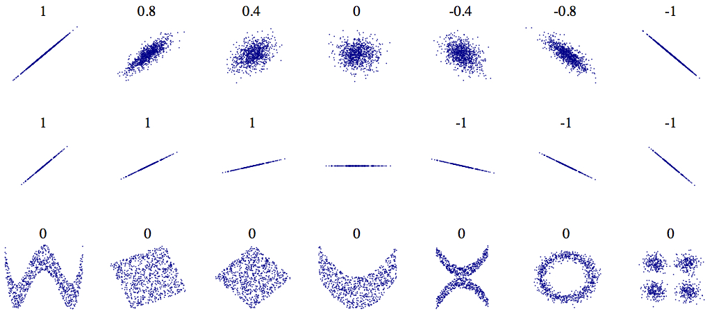

```{r my_opts, cache=FALSE, include=FALSE}
library(knitr)
knit_hooks$set(small.mar = function(before, options, envir) {
    if (before) par(mar = c(4, 4, .1, .1))  # smaller margin on top and right
})
opts_chunk$set(fig.align="center", fig.height=5.5, fig.width=6.75, collapse=TRUE, comment="", prompt=TRUE, small.mar=TRUE)
options(width=63)
library("ggplot2")
theme_set(theme_bw())
library("dplyr")
library("broom")
set.seed(201)
```

# </img>

# Inference on Binomial Data in R

## *OIS* Exercise 6.10

The way a question is phrased can influence a person's response. For example, Pew Research Center conducted a survey with the following question:

"As you may know, by 2014 nearly all Americans will be required to have health insurance. [People who do not buy insurance will pay a penalty] while [People who cannot afford it will receive financial help from the government]. Do you approve or disapprove of this policy?"

For each randomly sampled respondent, the statements in brackets were randomized: either they were kept in the order given above, or the two statements were reversed. 

## The Data

Table 6.2 shows the results of this experiment, reproduced below. 

2nd Statement | Sample Size | % Approve Law | % Disapprove Law | % Other
------------- | ----------- | ------------- | ---------------- | -------
"people who cannot afford it will receive financial help from the government" | 771 | 47 | 49 | 3
"people who do not buy it will pay a penalty" | 732 | 34 | 63 | 3

## Inference on the Difference

Create and interpret a 90% confidence interval of the difference in approval. Also perform a hyppthesis test that the approval rates are equal.

```{r}
x <- round(c(0.47*771, 0.34*732))
n <- round(c(771*0.97, 732*0.97))
prop.test(x=x, n=n, conf.level=0.90)
```

## *OIS* 90% CI

The book *OIS* does a "by hand" calculation using the $z$-statistics and comes up with a similar answer (but not identical).

```{r}
p1.hat <- 0.47
n1 <- 771
p2.hat <- 0.34
n2 <- 732
stderr <- sqrt(p1.hat*(1-p1.hat)/n1 + p2.hat*(1-p2.hat)/n2)

# the 90% CI
(p1.hat - p2.hat) + c(-1,1)*abs(qnorm(0.05))*stderr
```

# Inference on Poisson Data in R

## `poisson.test()`

```{r}
str(poisson.test)
```

From the help:
```
Arguments

x	 number of events. A vector of length one or two.

T	 time base for event count. A vector of length one or two.

r	 hypothesized rate or rate ratio

alternative  indicates the alternative hypothesis and must be one of 
"two.sided", "greater" or "less". You can specify just the initial letter.

conf.level  confidence level for the returned confidence interval.
```

## Example: RNA-Seq

RNA-Seq gene expression was measured for p53 lung tissue in 12 healthy individuals and 14 individuals with lung cancer.

The counts were given as follows.

Healthy: 82 64 66 88 65 81 85 87 60 79 80 72

Cancer: 59 50 60 60 78 69 70 67 72 66 66 68 54 62

It is hypothesized that p53 expression is higher in healthy individuals.  Test this hypothesis, and form a 99% CI.

## $H_1: \lambda_1 \not= \lambda_2$

```{r}
healthy <- c(82, 64, 66, 88, 65, 81, 85, 87, 60, 79, 80, 72)
cancer <- c(59, 50, 60, 60, 78, 69, 70, 67, 72, 66, 66, 68, 
            54, 62)
```

```{r}
poisson.test(x=c(sum(healthy), sum(cancer)), T=c(12,14), 
             conf.level=0.99)
```

## $H_1: \lambda_1 < \lambda_2$

```{r}
poisson.test(x=c(sum(healthy), sum(cancer)), T=c(12,14), 
             alternative="less", conf.level=0.99)
```

## $H_1: \lambda_1 > \lambda_2$

```{r}
poisson.test(x=c(sum(healthy), sum(cancer)), T=c(12,14), 
             alternative="greater", conf.level=0.99)
```

## Question

Which analysis is the more informative and scientifically correct one, and why?

# Modeling Relationships Among Variables

## Rationale

One of the most important goals when analyzing data is to understand how variables relate to one another.  This may include:

- Characterizing how variables covary
- Measuring and identifying associations between variables
- Explaining the variation of one variable in terms of others
- Predicting the outcome of a variable in terms of others

## Strategies

We will consider both categorical and quantitative variables to achieve these goals.  Over the next few weeks we will study:

- Analyzing two categorical variables
- Analyzing two quantitative variables
- Least squares linear regression to characterize variation of a quantitative variable in terms of other variables
- Logistic regression to characterize the probability distribution of a dichotomous variable in terms of other variables
- Predicting future values of a given variable based on measured values of other variables

# Two Categorical Variables

## Survey Data

```{r, message=FALSE}
library("MASS")
data("survey", package="MASS")
survey <- tbl_df(survey)
head(survey)
```

## 2 x 2 Table

A contingency table:

```{r}
tbl = table(survey$Sex, survey$W.Hnd)
tbl
```

Let's test the null hypothesis that sex and writing hand are independent vs. the alternative hypothesis that they are dependent.

## Visualization

```{r, echo=FALSE}
df <- survey %>% dplyr::select(Sex, W.Hnd) %>% na.omit()
ggplot(data=df) + geom_bar(aes(x=Sex, fill=W.Hnd), position="stack") +
  scale_fill_manual(values=c("red", "blue"))
```

## Pearson's Chi-Squared Test

```{r}
str(chisq.test)
```

```{r}
chisq.test(tbl)
```

## Chi-Squared Distribution

A $\chi^2$ distribution with $d$ degrees of freedom is equivalent to the sum of $d$ independent Normal$(0,1)$ random variables.  

$$
\chi^2_d \sim Z_1^2 + Z_2^2 + \cdots + Z_d^2
$$

where $Z_1, Z_2, \ldots, Z_d$ are iid Normal$(0,1)$.

## Chi-Squared PDFs

```{r, echo=FALSE}
x <- seq(0.001, 15, 0.01)

df <- data.frame(x=c(x,x), y=c(dchisq(x, df=2), dchisq(x, df=3)), 
                 Distribution = c(rep("Chi^2 df=2", length(x)), 
                           rep("Chi^2 df=3", length(x))))

ggplot(data=df) + geom_line(aes(x=x, y=y, color=Distribution)) + 
  scale_color_manual(values=c("red", "blue")) + 
  labs(x="x", y="f(x)")
```

## Expected Counts

Observed counts:
```{r}
tbl
```

Expected (under $H_0$) counts:
```{r}
n <- sum(tbl)
p <- sum(tbl[1,])/n # freq Female 
q <- sum(tbl[,1])/n # freq Left
expected <- n * matrix(c(p*q, (1-p)*q, p*(1-q), (1-p)*(1-q)), 
                       nrow=2)
expected
```

## Chi-Squared Statistic

The chi-squared statistic is calculated as

$$
X^2 = \sum \frac{(O - E)^2}{E}
$$

where $O$ is the observed count, $E$ is the expected count, and the sum is taken over all cells in the table.

## Calculate the Statistic

```{r}
X2 <- sum((tbl - expected)^2 / expected)
X2

chisq.test(tbl, correct=FALSE)$statistic # equals X2
chisq.test(tbl)$statistic # with continuity correction
```

## Calculate the P-value

The null distribution of $X^2$ is a $\chi^2$ distribution with $d$ degrees of freedom.  We calculate $d$ by $d = (r-1)(c-1)$ where $r$ is the number of rows and $c$ is the number of columns.

```{r}
1-pchisq(X2, df=1)

chisq.test(tbl, correct=FALSE)$p.value
```

## Derivation

The theoretical derivation of this test is beyond the scope of this course.

However, it is worth noting that it is related to the $Z$-statistic approximation from last week:

$$Z = \frac{\mbox{estimator} - \mbox{parameter}}{\mbox{standard error}} \sim \mbox{Normal}(0,1).$$

## Guidelines for Practice

- The total number of observations should be "large" so that ...
- The expected number of counts per cell should be 10 or greater
- The observed number of counts per cell shoudl be 5 or greater

When these are violated, continuity corrections and simulation based p-values can be used... or other tests can be used such as Fisher's Exact Test --- see `fisher.test()`.

## Clapping and Writing Hand

```{r}
tbl = table(survey$Clap, survey$W.Hnd)
tbl
```

Note that now one of the categorical variables takes three values.

Also note the existence of low cell counts.

## Chi-Squared Test Via Simulation

```{r}
chisq.test(tbl)
```

We address this warning by simulating tables from the null hypothesis.

```{r}
chisq.test(tbl, simulate.p.value = TRUE, B=10000)
```

## Exercise Vs. Writing Hand

```{r}
tbl = table(survey$Exer, survey$W.Hnd)
tbl

chisq.test(tbl, simulate.p.value = TRUE, B=10000)
```

## Smoking Vs. Exercise

```{r}
tbl = table(survey$Smoke, survey$Exer)
tbl

chisq.test(tbl, simulate.p.value = TRUE, B=10000)
```

What feature of the data is this test ignoring?

## Goodness of Fit Tests

The `chisq.tes()` function also performs goodness of fit tests.  These are goodness of fit tests of a set of probabilities, very related to our tests of proportions from last week.

For example, suppose we want to test whether a six-sided die is fair.  We roll the die 100 times and record the frequency with which we observe each face.

```{r, echo=FALSE}
set.seed(201)
die <- sample(1:6, size=100, replace=TRUE)
die <- table(die)
```

```{r}
die
chisq.test(x=die, p=rep(1/6, 6))
```

# Two Quantitative Variables

## Correlation

- It is often the case that two or more quantitative variables are measured on each unit of observation (such as an individual).  

- We are then often interested in characterizing how pairs of variables are associated or how they vary together.

- A common measure that is used is called "correlation", which is most well suited for measuring linear associations

## Sample Correlation

Suppose we observe $n$ pairs of data $(x_1, y_1), (x_2, y_2), \ldots, (x_n, y_n)$. Their sample correlation is

\begin{eqnarray}
r_{xy} & = & \frac{\sum_{i=1}^n (x_i - \overline{x}) (y_i - \overline{y})}{\sqrt{\sum_{i=1}^n (x_i - \overline{x})^2 \sum_{i=1}^n (y_i - \overline{y})^2}} \\
\ & = & \frac{\sum_{i=1}^n (x_i - \overline{x}) (y_i - \overline{y})}{(n-1) s_x s_y}
\end{eqnarray}

where $s_x$ and $s_y$ are the sample standard deviations of each measured variable.

## Ranked-Based Correlation

- There are other ways to measure correlation that are less reliant on linear trends in covariation and are also more robust to outliers.

- Specifically, one can convert each measured variable to ranks by size (1 for the smallest, $n$ for the largest) and then use a formula for correlation designed for these ranks.

- One popular measure of rank-based correlation is the [Spearman correlation](https://en.wikipedia.org/wiki/Spearman%27s_rank_correlation_coefficient).

## Population Correlation

Suppose there are two random variables $X and $Y$.  Their population correlation is

$$
\rho_{XY} = \frac{{\rm E}\left[(X-{\rm E}[X])(Y-{\rm E}[Y])\right]}{\sqrt{{\rm Var}(X) {\rm Var}(Y)}}
$$

## Hand Size Vs. Height

```{r, warning=FALSE}
ggplot(data = survey, mapping=aes(x=Wr.Hnd, y=Height)) +
  geom_point() + geom_vline(xintercept=mean(survey$Wr.Hnd, na.rm=TRUE)) +
  geom_hline(yintercept=mean(survey$Height, na.rm=TRUE))
```

## Calculating Correlation

```{r}
str(cor)

cor(survey$Wr.Hnd, survey$Height, 
    use="pairwise.complete.obs")
```

```{r}
df <- survey %>% dplyr::select(Wr.Hnd, Height) %>% na.omit()
sum((df$Wr.Hnd - mean(df$Wr.Hnd)) *
      (df$Height - mean(df$Height))) /
  ((nrow(df)-1) * sd(df$Wr.Hnd) * sd(df$Height))
```

## Example Correlations

<center></center>

Image from [Wikipedia](https://en.wikipedia.org/wiki/Pearson_product-moment_correlation_coefficient#/media/File:Correlation_examples2.svg).


## HT of Correlation

```{r}
str(cor.test)
```

From the help file:

```
Usage

cor.test(x, ...)

## Default S3 method:
cor.test(x, y,
         alternative = c("two.sided", "less", "greater"),
         method = c("pearson", "kendall", "spearman"),
         exact = NULL, conf.level = 0.95, continuity = FALSE, 
         ...)

## S3 method for class 'formula'
cor.test(formula, data, subset, na.action, ...)
```

## HT of Correlation

```{r}
cor.test(x=survey$Wr.Hnd, y=survey$Height)
```

## HT By Hand

Compare the following to the above output of `cor.test()`.

```{r}
r <- cor(survey$Wr.Hnd, survey$Height, 
    use="pairwise.complete.obs")
df <- sum(complete.cases(survey[,c("Wr.Hnd", "Height")]))-2
# dplyr way to get df:
# df <- (survey %>% select(Wr.Hnd, Height) %>% 
#        na.omit() %>% nrow())-2 

tstat <- r/sqrt((1 - r^2)*df)
tstat

pvalue <- 2*pt(q=-abs(tstat), df=df)
pvalue
```

## Hand Sizes

```{r, warning=FALSE}
ggplot(data = survey) +
  geom_point(aes(x=Wr.Hnd, y=NW.Hnd))
```

## Correlation of Hand Sizes

```{r}
cor.test(x=survey$Wr.Hnd, y=survey$NW.Hnd)
```

## Davis Data

```{r, message=FALSE}
library("car")
data("Davis", package="car")
```

```{r}
htwt <- tbl_df(Davis)
htwt[12,c(2,3)] <- htwt[12,c(3,2)]
head(htwt)
```

## Height and Weight

```{r}
ggplot(htwt) + 
  geom_point(aes(x=height, y=weight, color=sex), size=2, alpha=0.5) +
  scale_color_manual(values=c("red", "blue"))
```

## Correlation Test

```{r}
cor.test(x=htwt$height, y=htwt$weight)
```

## Correlation Test with Outlier

Recall we had to fix an error in the data, which we noticed as an outlier in the scatterplot.  Here is the effect of the outlier:

```{r}
cor.test(x=Davis$height, y=Davis$weight)
```

## Correlation Test with Outlier

Let's use the Spearman rank-based correlation:

```{r}
cor.test(x=Davis$height, y=Davis$weight, method="spearman")
```

## Correlation Among Females

```{r}
htwt %>% filter(sex=="F") %>%  
  cor.test(~ height + weight, data = .)
```

## Correlation Among Males

```{r}
htwt %>% filter(sex=="M") %>%  
  cor.test(~ height + weight, data = .)
```

Why are the stratified correlations lower?


```{r, eval=FALSE, echo=FALSE}
# Least Squares Regression


# Regression with Several Variables


# Regression with Mixed Variable Types
```

# Extras

## License

<https://github.com/SML201/lectures/blob/master/LICENSE.md>

## Source Code

<https://github.com/SML201/lectures/tree/master/week9>

## Session Information

<section style="font-size: 0.75em;">
```{r}
sessionInfo()
```
</section>

```{r converttonotes, include=FALSE, cache=FALSE}
source("../customization/make_notes.R")
```
